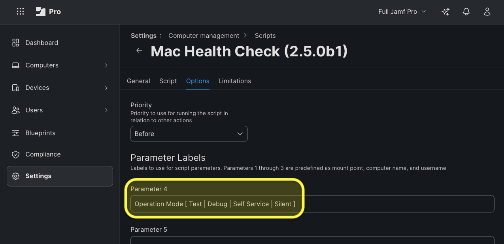
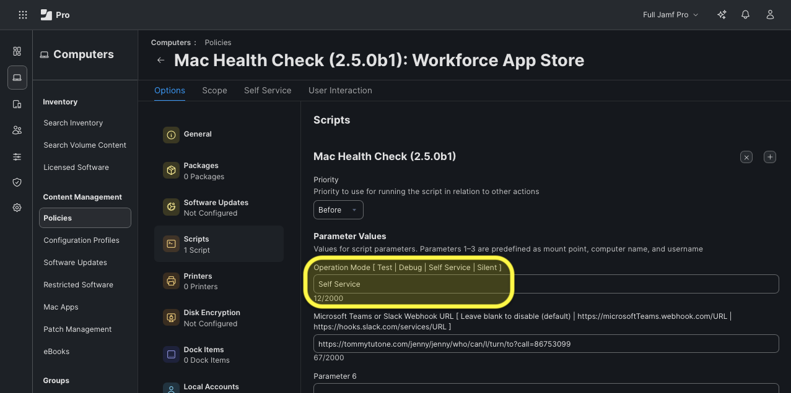
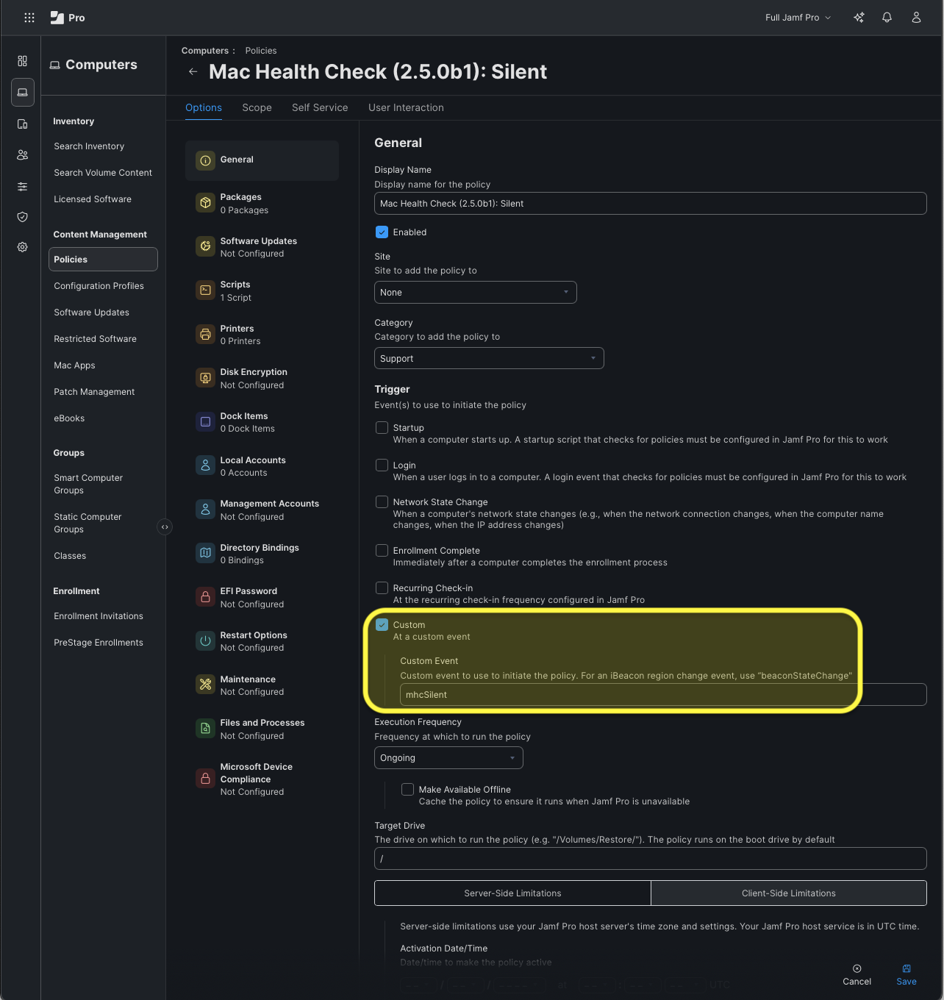
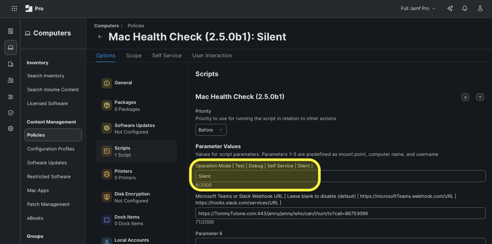

# Mac Health Check

## CHANGELOG

### 2.6.0 (06-Nov-2025)
- Added check for "Electron Corner Mask" https://github.com/electron/electron/pull/48376
- Added check for Touch ID (Pull Request #54; thanks, @alexfinn!)
- Added "Electron Corner Mask" list o' apps to Webhook message
- Addressed Bug: Software Update check shows wrong installed version (Issue #55; thanks for the heads-up, @coalis!)

---

### 2.5.0 (20-Oct-2025)
- Added "System Memory" and "System Storage" capacity information (Pull Request #36; thanks again, @HowardGMac!)
- Corrected misspelling of "Certificate" in multiple locations (Pull Request #41; thanks, @HowardGMac!)
- Improved handling of the `checkJamfProCheckIn` and `checkJamfProInventory` functions when no relevant data is found in the `jamf.log` file
- Refactored `checkAvailableSoftwareUpdates` to include DDM-enforced OS Updates
- Added error-handling for `organizationOverlayiconURL`
- Minor Cisco VPN fixes (Pull Request #47; thanks, @HowardGMac!)
- Update to External checks to allow defaults use (Pull Request #48; thanks, Obi-@HowardGMac!)
- Added the size and item count of the user's Desktop and Trash to the Jamf Pro Policy Log Reporting
- Added `checkUserDirectorySizeItems` function to report the size and item count of any user directories (e.g. Desktop, Downloads, Trash, etc.)
- Added a Health Checks for Signed System Volume (SSV) and Gatekeeper / XProtect (thanks for the reminder, @hoakley!)
- Refactored "DDM-enforced OS Version" per [DDM-OS-Reminder](https://github.com/dan-snelson/DDM-OS-Reminder)
- Refactored `checkUserDirectorySizeItems` to ignore hidden files
- Simplified various date / time formats
- Refactored `checkNetworkHosts` to use `nc` for ports or `curl` for URLs (thanks for the idea, @ecubrooks!)
- Added Server-side Logging to summarize errors (thanks for the idea, @isaacatmann!)
- Introduces a new `operationMode` of "Silent" to run all checks and log results without displaying a dialog to the end-user

    > :warning: **Breaking Change** :warning:
    > 
    > The `operationMode` variable is now case-sensitive and the former "production" option has been renamed to "Self Service".
    > 
    > Please update any existing policies that set this variable to use: "Test", "Debug", "Self Service" or "Silent" (with initial capital letters).

    

        
Click to view screenshots

        

            
Script

             Computer Management > Scripts > Options > Parameter Labels > Parameter 4" width="600"/> 
            Settings > Computer Management > Scripts > Options > Parameter Labels > Parameter 4  
            <code>Operation Mode [ Test | Debug | Self Service | Silent ]</code>
        

        

            
Self Service Policy

             Policies > Options > Scripts > Parameter Values > Self Service" width="600"/> 
            Computers > Policies > Options > Scripts > Parameter Values > <code>Self Service</code>
        

        

            
Silent Policy

             Policies > Options > General > Trigger > Custom > customTriggerName" width="600"/> 
            Computers > Policies > Options > General > Trigger > Custom > <code>customTriggerName</code>  
             Policies > Options > Scripts > Parameter Values > Silent" width="600"/> 
            Computers > Policies > Options > Scripts > Parameter Values > <code>Silent</code>
        

    

---

### 2.4.0 (20-Sep-2025)
- Updated SSID code (thanks, ZP!)
- Added troubleshooting code for common JSON issues
- Additional troubleshooting tweaks
- Updates to leverage new features of swiftDialog 3.0.0
- Updated `listitem` icon colour to reflect status
- Updated `checkOS` function
- Visually enchanced `listitem` error and failure statuses
- Added Organization's Color Schemes based on light or dark mode (Pull Request #37; thanks, @AndrewMBarnett!)

---

### 2.3.0 (26-Aug-2025)
- Enhanced `operationMode` to verbosely execute when set to `debug` (Addresses Issue #28)
- Adjusted GlobalProtect VPN check for IPv6
- Enhanced `checkJssCertificateExpiration` function (Addresses Issue #27 via Pull Request #30; thanks, @theahadub and @ScottEKendall)
- Extended Network Checks (Pull Request #31 addresses Issue #23; thanks big bunches, @tonyyo11!)
- Added `organizationBrandingBannerURL` (thanks for the inspiration, @ScottEKendall!) [Image by benzoix on Freepik](https://www.freepik.com/author/benzoix)
- Adjusted `checkVPN` function to report "Unknown" for the catch-all condition of `vpnStatus`
- Added "Connected" and "Disconnected" options to `checkVPN` function
- Adjusted Palo Alto Networks GlobalProtect VPN Information
- Fallback to a list o' preferred wireless networks when SSID is redacted (leverages a new space-separated list of SSIDs, `organizationSSID`)

---

### 2.2.0 (15-Aug-2025)
- Improved the GlobalProtect VPN IP detection logic
- Added an option to show if an app is installed (Feature Request #18; thanks, @ScottEKendall!)
- Add framework for different VPN clients and an internal VPN Client Check (Pull Request #16; thanks for another one, @HowardGMac!)
- Addressed MHC does not show SF Symbols in the upper left corner - needs region check (Issue #21; thanks, @hbokh!)
- Active IP Address section changes (Pull Request #24; thanks, Obi-@HowardGMac!)
- Use zsh expansion in the `checkExternal` function to convert the results to lowercase so that the user doesn't have to match the case exactly in their results (Pull Request #25; thanks, @ScottEKendall!)
- Added Tailscale VPN check (thanks, @alexfinn!)
- Change zsh logic flag for Dialog check / installation from `-e` to `-x` to make sure file exists and is executable (Pull Request #26; thanks, @ScottEKendall!)

---

### 2.1.0 (24-Jul-2025)
- Added an `operationMode` of "debug" to specifically enable swiftDialog debugging
- Improved error handling for malformed `plistFilepath` variables (Addresses Issue #2)
- Updated overlayicon to be MDM-agnostic (Addresses Issue #3)
- Added Secure Token status check to `helpmessage` (Addresses Issue #4)
- Addition of Packet Firewall status check option (Pull Request #5; thanks, @HowardGMac!)
- Updated MHC_icon.png
- Update Firewall Cases to include one for State 2 (Pull Request #8; thanks, @mam5hs!)
- Fix for Free Disk Space comparison bug (Addresses Issue #10). (Pull Request #11; thanks again, @HowardGMac!)
- Added bootstrap token status

---

### 2.0.0 (18-Jul-2025)
- Renamed to "Mac Health Check" (thanks, @uurazzle and @scriptingosx!)
- Added Webhook functionality
- Cleaned-up `checkExternal` error and failure reporting
- Corrected `dialogBinary` execution parameters (thanks, @fraserhess, @bartreardon and @BigMacAdmin!)
- Added "Current Elapsed Time" to document execution time prior to dialog creation
- Improved `quitScript` function to immediately exit the script when the user clicks "Close"
- Added "set -x" when `operationMode` is set to "test" (to better identify variable initialization issues; I'm looking at you, SSID!)
- (Hopefully) improved regex for "Palo Alto Networks GlobalProtect VPN IP address" to avoid "JSON import failed" error
- Corrected Slack Webhook (thanks, @drtaru!)

---

### 1.9.0 (10-Jun-2025)
- Updates for macOS 26

### 1.8.0 (17-May-2025)
- Added "warning" when logged-in user is a member of `admin`

### 1.7.0 (07-May-2025)
- Updated `checkOS` function to display macOS version and build to user
- Removed OS version from `infobox`

### 1.6.0 (30-Apr-2025)
- Added countdown progress bar to `quitScript` function (thanks, @samg and @bartreadon!)

### 1.5.0 (29-Apr-2025)
- Added `jamf recon` as final "check"
- Improved logging output

### 1.4.0 (28-Apr-2025)
- Added `timer` option to swiftDialog
- Added forcible-quit for all other running dialogs

### 1.3.0 (23-Apr-2025)
 - Added sudoers check

### 1.2.0 (19-Apr-2025)
- Added `operationMode` [ test | production ]

### 1.1.0 (17-Apr-2025)
- Added output of `/usr/libexec/mdmclient AvailableOSUpdates` to `$scriptLog`

### 1.0.0 (15-Apr-2025)
- First "official" release

---

### 0.0.17 (14-Apr-2025)
- Better control the caching of the networkQuality test (See: `networkQualityTestMaximumAge`)

### 0.0.16 (11-Apr-2025)
- Cache `networkQuality` test results

### 0.0.15 (11-Apr-2025)
- Supressed various error messages (i.e., `2>/dev/null` is your friend)

### 0.0.14 (11-Apr-2025)
- Supressed extraneous output from `checkAvailableSoftwareUpdates`

### 0.0.13 (11-Apr-2025)
- Dialog is now "ontop" and can be minimized
- Added `checkAvailableSoftwareUpdates`
- Added `locationServicesStatus` to quitScript output
- Moved `batteryCycleCount` to quitScript output
- Moved `jamfProID` to quitScript output
- Moved `networkTimeServer` to quitScript output
- Removed `kerberosSSOeResult` from `helpmessage`
- Removed `localHostName` from `helpmessage`
- Removed `computerModel` from `helpmessage`
- Removed `tmStatus` from `helpmessage`

### 0.0.12 (10-Apr-2025)
- Added `excessiveUptimeAlertStyle` varible (so excessive uptime will result in a "warning" or "error")
- Added `organizationColorScheme` to more easily brand the various SF Symbols

### 0.0.11 (10-Apr-2025)
- Added computer information to pre-flight section of logs

### 0.0.10 (10-Apr-2025)
- Modified Uptime Check to use `warning` for excessive uptime
- Removed stray occurrences of `results`

### 0.0.9 (10-Apr-2025)
- Added check for System Integrity Protection
- Added check for built-in firewall
- Added check for APNs
    - Renamed the previous, so-called "MDM" checks to "Jamf Pro"
- Replaced `errorOut "${1}"` in indvidual checks with more verbose, specific log output

### 0.0.8 (08-Apr-2025)
- Added JSS Built-in Certificate Authority expiration check (thanks, @isaacatmann!) [JNUC 2024](https://github.com/mannconsulting/JNUC2024/)

### 0.0.7 (08-Apr-2025)
- Added multiple drive support to Time Machine check (thanks, obi-@bartreadon!) [Issue #65](#65)

### 0.0.6 (07-Apr-2025)
- Added check for the Jamf Pro MDM Profile
- Improved `checkSetupYourMacValidation` logic

### 0.0.5 (07-Apr-2025)
- Added check for Microsoft OneDrive's last sync time

### 0.0.4 (07-Apr-2025)
- Added `infobuttontext` and `infobuttonaction` for the Knowledge Base article (in main dialog)

### 0.0.3 (07-Apr-2025)
- Added `exitCode` variable (to better report failures as errors in the Jamf Pro policy)
- Adjusted `tmLastBackup` message (for when no Time Machine destination is configured)

### 0.0.2 (04-Apr-2025)
- Replaced manually created variables with swiftDialog built-ins (thanks for the reminder, @bartreadon!)
- Applied Band-Aid for macOS 15 `withAnimation` SwiftUI bug
- Included the output of several "helpmessage" variables to ${scriptLog}
- Skipped Compliant OS Version check for Beta OSes

### 0.0.1 (03-Apr-2025)
- Original, proof-of-concept version inspired by @robjschroeder