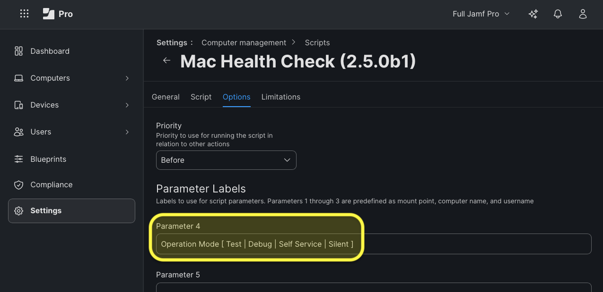
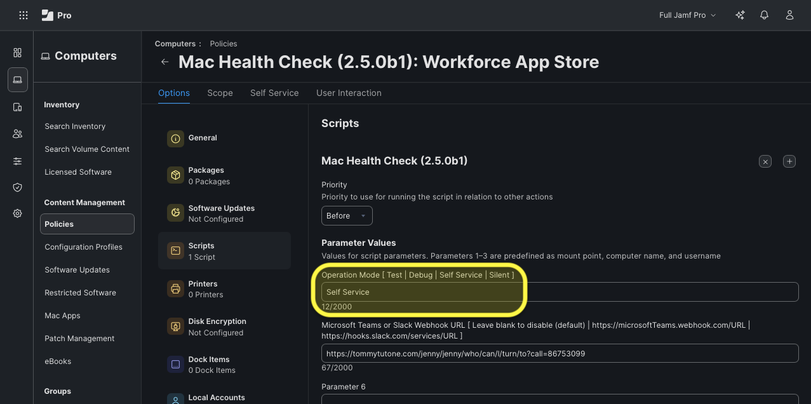
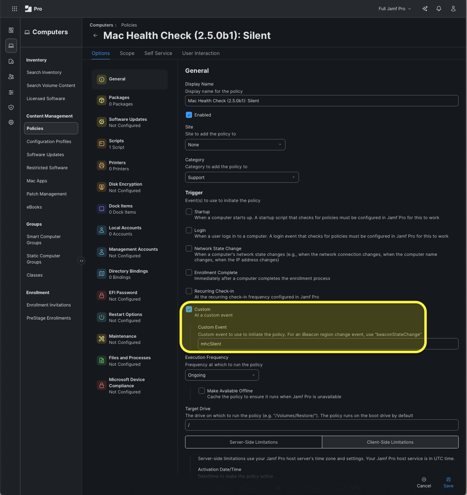
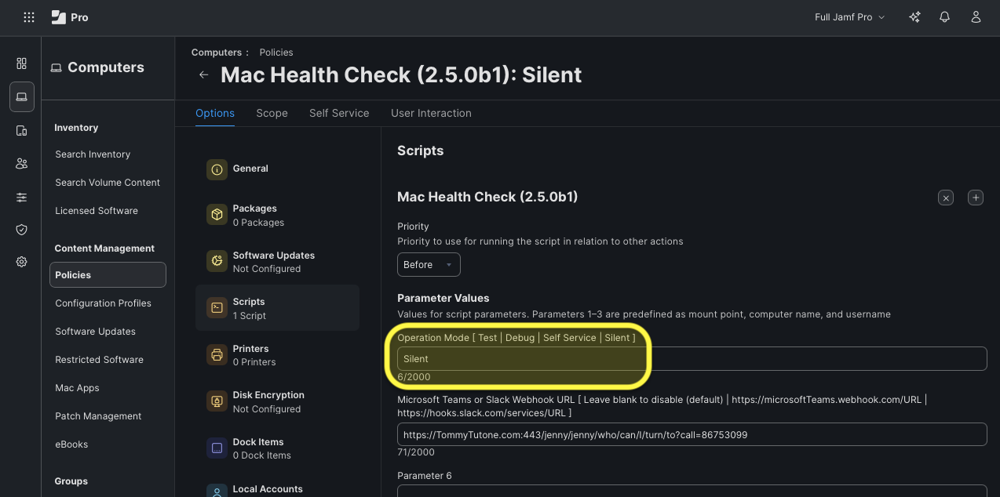

# Mac Health Check

## CHANGELOG

### 5.0.0 (04-Oct-2026)
- **Security:** `checkElectronCornerMask()` no longer copies arbitrary file contents into user-readable output. A standard user could link `~/Applications/<App>.app/…/Electron Framework.framework/…/version` to any root-only file (including `MacHealthCheck-Secrets.plist`), and root then echoed its contents into the dialog, the Inspect compliance plist, the client log and the Splunk report. To prevent this:
    - Symlinked app bundles, frameworks and `version` / `version.txt` files are skipped
    - `version` / `version.txt` files are read with a 64-byte cap
    - Every version value must be version-shaped (or `custom-<commit>`); anything else is reported as `version unknown`
    - Removed the name-based `Visual Studio Code` / `Slack` "known fixed" allowlist; both now report their actual Electron framework version
    - Rotate the Splunk HEC token and webhook URL on any macOS 26 (or later) Mac that ran a 5.0.0 beta with the secrets file in place
- **Security:** `checkExternalJamfPro()` now treats `Not Running` as a failure; previously it matched the `Running` success pattern, so stopped Zscaler, Nessus and Splunk forwarder agents were reported as healthy
    - Each external-check `jamf policy -event` call is now limited to `externalCheckTimeoutSeconds` (default `120`) and reports `Timed Out` instead of stalling the run
    - Sample external checks now print `Failed: Not Running` (Zscaler, Nessus, Splunk Universal Forwarder; `Nessus Agent Status.sh` no longer treats `not running` as `running` and reports `Not Installed` when the agent is absent), `Failed: …` / `Running` (Printer, Microsoft Office 365), and use `#!/bin/bash` instead of `#!/usr/bin/env bash`
    - `Sophos Endpoint RTS.bash` (`0.0.2`) now prints `Failed: Real Time Scanning Disabled` (previously `Disabled`, reported as an error), and `CrowdStrike Falcon Status.bash` reports a missing Falcon agent (`No such file`) as `Failed: Not Installed` instead of `Not Installed`
    - `Splunk Universal Forwarder Check.sh` (`1.1.3`) captures `splunk status` output before matching, so `pipefail` cannot report a running forwarder as `Failed: Not Running`
    - `Check Printer Install.zsh` now runs with `--no-rcs` and a fixed system `PATH`
    - `TenableNessusAgent-Alternate.sh` no longer lets `Running: Yes` overwrite an authentication-error or not-linked result, and reports `Not Running` (fail) when the agent is installed but stopped
    - `CrowdStrike Falcon Status.bash` (`0.0.16`) now restores (or removes) the system and root `AppleLocale` values on exit or termination instead of permanently setting `en_US`; locales changed by earlier versions are not restored automatically
    - `Microsoft Defender Check.sh` (`0.0.3`) now calls the first executable of `Tools/mdatp` or `Tools/wdavdaemonclient` inside `/Applications/Microsoft Defender.app/Contents/Resources/` instead of user-writable `/usr/local/bin/mdatp`
    - Removed `/usr/local/bin` from `PATH` in the BeyondTrust (`0.0.5`), Cisco Umbrella (`0.0.8`), CrowdStrike Falcon, GlobalProtect (`0.0.4`), Nessus Agent, Splunk Universal Forwarder and Zscaler Tunnel external checks
- **Security:** user-writable logs can no longer make health checks look healthy
    - `checkAppAutoPatch()` now supports App Auto-Patch `4.0.0`, preferring root-written logs (4.x `/Library/Application Support/AppAutoPatch/logs/aap.log`, then 3.x `/Library/Management/AppAutoPatch/logs/aap.log`) and reading the per-user `~/Library/Logs/AppAutoPatch/aap.log` only when neither exists (logged as user-reported); uses the newest `Discovery complete` timestamp, ignores timestamps more than five minutes in the future, and reports `Unable to determine last run` when a 4.x log has no `Discovery complete` entry
    - `checkAvailableSoftwareUpdates()` reads DDM enforcement from the root-written `/var/db/softwareupdate/SoftwareUpdateDDMStatePersistence.plist` (`TargetOSVersion` / `TargetLocalDateTime`; highest declared version wins), falling back to the `install.log` resolver (and its padded-date lookup) only when the plist is missing, untrusted or unrecognized; logs `DDM Resolver: source=statePlist`
    - `checkAPNs()` only counts log entries from processes under `/System/` or `/usr/libexec/`
- **Security:** reporting secrets now fail closed
    - Added an optional root-only secrets file, `/Library/Management/org.churchofjesuschrist/MacHealthCheck-Secrets.plist` (`splunkHECToken`, `webhookURL`; `root:wheel` mode `600`), which keeps those secrets out of the process list; each run logs the secret source
    - A Splunk HEC token or webhook URL supplied only through Parameters 8 or 5 is rejected and logged as `[ERROR]` (Splunk HEC delivery and webhook messages are skipped); `Silent` + `splunkOperationMode=production` runs whose only HEC token is a rejected Parameter 8 value exit `1` before discovery
    - Source-level `allowParameterSecrets="true"` is a temporary, not-recommended legacy opt-in that accepts parameter secrets with a process-list `[WARNING]`
    - Corrected the README claim that parameters never appear in the process list
- **Security:** report delivery
    - Splunk HEC and webhook `curl` calls use `--proto =https --tlsv1.2`; non-`https://` URLs are refused and logged
    - Slack and Microsoft Teams webhook messages now use a shared `sendWebhookPayload()` sender matching the Splunk HEC pattern (`--fail-with-body`, `--max-time 15`, HTTP status capture, up to three attempts with backoff for HTTP `5xx` or `000` only); rejected deliveries log a `[WARNING]` with the HTTP status and a short response excerpt instead of only the `curl` exit code; webhook failures do not change report status or exit codes
    - Parameter 6 `splunkOperationMode` now fails safe: only `off`, `test` or `production` (case-insensitive) are accepted, and any unrecognized value falls back to `test` with an `[ERROR]` log entry instead of silently enabling production Splunk HEC delivery
    - `Test` and `Development` runs now write `MacHealthCheck-Report-<mode>.json` instead of the canonical report, skip Splunk HEC delivery and never install the Client-Side Cache copy; cached uploads and targeted rechecks reject canonical reports whose `metadata.operationMode` is not `Self Service` or `Silent`
- **Security:** runtime state moved off world-writable `/var/tmp`
    - Canonical report and lock, SOFA and `networkQuality` caches now live in root-owned `organizationDirectory`; cached reports are trusted only when they are root-owned regular files
    - User-facing Inspect assets (config and compliance plist) now live in a root-owned `0755` tree at `/Library/Application Support/${reverseDomainNameNotation}/Inspect`, with per-user control files under `Inspect/Users/<user>`; the canonical report, secrets and caches remain root-only in `organizationDirectory`
    - Root-owned, non-symlink pre-`5.0.0` `/var/tmp` leftovers and 5.0.0-beta Inspect leftovers in `organizationDirectory` are removed automatically
    - swiftDialog command and JSON files are now root-owned `600` with a read-only ACL for the console user (previously world-readable `644`)
    - The `/var/tmp/MacHealthCheck-Force-Fresh-Run` trigger is honored only when root-owned; triggers created by other users are ignored, logged and removed
- **Security:** hardened code based on Monocle findings
    - Removed `/usr/local/bin` from the script and LaunchDaemon `PATH`; swiftDialog now runs from `Dialog.app/Contents/MacOS/dialogcli`, Jamf Pro from `/usr/local/jamf/bin/jamf`, and `jq` from `/usr/bin/jq` or a root-owned install only (user-owned Homebrew `jq` is rejected)
    - Refactored `Resources/createSelfExtracting.zsh` (now `#!/bin/zsh --no-rcs`) so generated wrappers decode into a root-only `mktemp -d` directory, run `/bin/zsh --no-rcs` with all forwarded arguments (Jamf Pro Parameters 1-11) and remove the copy on exit, replacing the fixed, pre-plantable `/var/tmp/MHC.zsh` path; removed the `--target` option
    - `Resources/Makefile` now installs the package payload to root-owned `/Library/Management/org.churchofjesuschrist/Mac-Health-Check.zsh` instead of user-writable `/usr/local/bin/Mac-Health-Check`, stages packages under the per-user `$TMPDIR` and refuses a staging directory it does not own; `Resources/postInstall.zsh` runs the payload with `/bin/zsh --no-rcs` in `Self Service` mode
    - Pinned Semgrep to `1.177.0` in `.github/workflows/security-scan.yml`
- Client-Side Cache
    - `installClientSideScript()` copies the running script into the root LaunchDaemon's path only when it is a root-owned file whose parent directories are root-owned and not group- or world-writable (new `isTrustedRootPath()`), and refuses to install a sanitized copy that fails `zsh -n` or lacks the `Silent` default
    - `isTrustedRootPath()` reads the sticky bit (`stat -f %Mp%Lp`; `%Lp` alone drops it), so scripts decoded by self-extracting wrappers into a root-only directory under sticky `/var/tmp` install the Client-Side Cache copy instead of always logging `install skipped`
    - Installs or refreshes the client-side copy before the cached-upload shortcut, so content changes reach the nightly LaunchDaemon copy even without a `scriptVersion` bump
    - The nightly LaunchDaemon run no longer sends Microsoft Teams / Slack webhook messages (it refreshes the cached report only)
    - Cached-upload runs skip the two whole-disk `mdfind` queries and `system_profiler` (their values are only logged by full runs)
- Added targeted `Self Service` remediation verification for Issue #103: valid non-healthy reports with a full-run baseline under 36 hours now rerun only affected stable check keys, merge results into the canonical full-state report with per-check timestamps, and fall back safely to a full run when validation fails; Jamf Pro targeted rechecks also run `Computer Inventory`, and targeted webhook messages are sent only when a rechecked status changes
    - Nightly Client-Side Cache `Silent` reports also serve as targeted-recheck and cached-replay baselines: check-set validation ignores `Computer Inventory` (which the sanitized client-side copy omits), targeted merges append the rechecked `Computer Inventory` result, and its absence from the base does not count as a status change for webhook messages
- Added warning-only Memory Pressure history for full health-check runs, nightly Silent refreshes, and targeted memory-pressure rechecks, with a root-only 14-day JSON Lines history and a two-distinct-day pattern threshold over seven days; cached uploads and replay retain their original observations
- Added `checkClockSkew()` to Jamf Pro runs to detect local clock offset against `time.apple.com` before inventory submission and flag skew above 5 minutes
- `checkAPNs()` now also reads `apsd` courier connections and incoming-message acknowledgements (thanks, [Der Flounder](https://derflounder.wordpress.com/2026/08/29/checking-apns-communication-on-macos-tahoe/)!) in a single `log show` query; the ManagedClient `Received HTTP response (200)` match remains the MDM success evidence because `apsd` redacts push topics as `<private>`
    - APNs activity without an MDM response in the last 24 hours now reports `APNs active; no MDM response` as a warning (previously `Failed`)
    - MDM identity error `-25304` newer than the last MDM response now reports `MDM identity error` as a failure
    - Logs the last APNs activity, last MDM response and courier connection-failure count
    - The no-MDM-response warning reads `No MDM response in 24 hours` on unenrolled Macs (previously `No None response …`)
    - Added to the curated `Development` subset
- Raised the minimum required swiftDialog version to `3.1.1.4997`
    - Updated the generated Preset 6 Inspect config to declare window options through swiftDialog `3.1.1.4997`'s JSON `options` block (`moveable`, `ontop`, `windowbuttons: "min"`), replacing an ignored top-level `moveable` key and adding a minimise button to the detached summary; `--ontop --moveable` launch flags remain for older swiftDialog builds
    - An empty `dialogcli --version` no longer passes the swiftDialog minimum-version gate or the latest-production-release shortcut
    - The detached Preset 6 Inspect summary now sets `DIALOG_DEBUG=1` only in `Debug` mode
    - Documented that the Dock-named swiftDialog copy is re-signed ad hoc (Team ID dropped); set `enableDockIntegration="false"` where PPPC or notification profiles key on swiftDialog's Team ID
- macOS 27 compatibility
    - Refactored `checkAirPlayReceiver()` to recognize macOS 27's new missing-key response and enabled-by-default behavior, preventing `Status Unknown` results when AirPlay Receiver preferences are absent
    - Fixed `Battery Cycle Count` reporting `=` on macOS 27, where `ioreg` prefixes the `CycleCount` line with a tree marker
    - Suppressed `mdmclient AvailableOSUpdates` stderr, which macOS 27 rejects as an unrecognized command, so `Silent` production logs no longer capture the `mdmclient` usage banner
- `checkJamfProCheckIn()` now counts `startup`, `login` and `networkStateChange` triggers alongside `recurring check-in`, preventing false warnings on Macs powered off overnight, and parses `jamf.log` timestamps with the current year (falling back to the prior year for future dates), preventing false successes across the December-to-January rollover
- `Microsoft OneDrive Sync Date` now uses the local date instead of UTC, preventing evening runs from reporting tomorrow's date (affects the quit summary, help message, Inspect and the Splunk `oneDriveSyncDate` value)
- SOFA cache refreshes now revalidate a stale feed with its stored ETag (HTTP `304` refreshes the cache age) instead of deleting the cache first, keep the stale feed when a download fails, and allow `10` seconds (previously `3`) for the initial download
- `killProcess()` now matches exact process names (`pgrep -x`) and terminates every matching PID (previously two or more PIDs caused `illegal pid` and nothing was killed)
- Cleanup removes only this run's swiftDialog command and JSON files, removes the Dock-named swiftDialog copy only when this run created it, and leaves `/var/tmp/dialog.log` in place for `Silent`, so a `Silent` run no longer deletes a concurrent `Self Service` run's files
- `ipconfig setverbose` is enabled only when it was off and restored only when this run changed it
- Fixed dark-mode detection for console usernames containing spaces, and replaced the undefined `result` call in `checkOS()` with a warning
- Polished log output; check results, statustext and report values are unchanged
    - `checkWiFiStrength()` logs `Fair` results as `[WARNING]` and `Poor` results as `[ERROR]`, matching their list-item statuses
    - `checkHomebrewStatus()` logs its warning-level results as `[WARNING]` instead of `[ERROR]`
    - swiftDialog older than `swiftDialogMinimumRequiredVersion` (when no newer production release exists) logs `[WARNING]` instead of `[PRE-FLIGHT]`
    - Leading zero on user-directory disk percentages (i.e., `0.06% of disk`)
    - Rounded Network Quality responsiveness and removed the trailing `; `
    - `Warning: ` / `Error: ` spacing in `checkExternalJamfPro()`
    - `; ` separator between Time Machine destinations and backup dates
    - Removed trailing `; ` from `checkNetworkHosts()` and `checkElectronCornerMask()` logs, and the trailing space from `Run "…" as "<UID>" …` lines
    - DDM Resolver logs explain non-zero resolver exits and show `build=unavailable` instead of `(null)`
    - Inspect Summary Replay logs one specific reason when falling back to a full run (removed the generic `no eligible cached summary` line)
    - Client-Side Cache logs `evaluating` (instead of `installing`) before checking whether the cached copy is current, and logs `generated LaunchDaemon plist validated` only when an install proceeds
    - Kandji's `Microsoft One Drive` check logs its list-item title (previously `Microsoft OneDrive`)
- Removed unused `getEntraPSSOStatusRaw()` and `getEntraLegacyCertificateOutput()` helpers
- Reports from earlier versions (including 5.0.0 betas) do not match the `5.0.0` script version, so the first `5.0.0` `Self Service` run on each Mac is a full run
- Agent Experience
    - Introduced the `mac-health-check-selector` AI Skill to assist Mac Admins with custom deployment; after the selection is confirmed, it asks whether to remove other MDMs' code from the artifact (default `no`)
    - `build-artifact.zsh --prune-other-mdms` removes every other MDM's list-item array, its branches in each vendor `case` block (including `serverURL` detection), and unreferenced vendor-only functions (`checkJamfProCheckIn`, `checkJamfProInventory`, `checkExternalJamfPro`, `updateComputerInventory`, `jamfHosts`, `checkMosyleCheckIn`), keeps the generic fallback, and validates the result with checks 4b and 4c
    - `build-artifact.zsh` refuses a source script that is world-writable or owned by neither the current user nor root, and check 5d confirms the sanitized Client-Side Cache copy keeps the `Silent` default
    - `references/health-checks.md` documents the `Not Running` and timeout behavior and the three-check `Development` subset
    - `AGENTS.md` treats `scriptVersion` as canonical (`VERSION.txt` is git-ignored) and replaces the health-check template with a real single-argument `dialogUpdate` pattern
    - `.github` Copilot agents and instructions rewritten for Mac Health Check (`reminder-*` files renamed to `inspect-*`); bug reports add `Targeted remediation recheck` and `Reporting secrets` areas
    - `AGENTS.md` uses branch-neutral release-state wording, adds a selector-skill step to the Add New Health Check skill, lists every selector file to keep synchronized, and uses `zsh --no-rcs` for test runs; added a tracked one-line `CLAUDE.md` (`@AGENTS.md`)
    - Selector skill documents `checkAPNs()` warning-or-fail outcomes, the external-check parsing order (timeout, defaults domain, keywords), helper `--source` / `--out-dir` / `-h` options, and new `[H7]` / `[M2]` sidecar notes
    - `.gitignore` now ignores built packages (`Resources/*.pkg`), self-extracting scripts (`*_self-extracting-*.sh`), `.claude/settings.local.json` and `.codex/` (`.codex/config.toml` is no longer tracked)
- Documentation: README, `Diagrams/`, `Resources/`, `SECURITY.md`, `CONTRIBUTING.md` and issue templates refreshed for `5.0.0` (check counts per MDM, three-check `Development` subset, Client-Side Cache install order, report fields)
    - README adds Script Parameters (noting that Parameter 4 is case-sensitive and not validated), Exit Codes and MDM Detection sections, documents that webhook messages are effectively Jamf Pro-only, describes `checkAPNs()` outcomes, notes that the four Jamf Pro sample external checks run by default, warns that the uninstall snippet also deletes `MacHealthCheck-Secrets.plist`, and regenerates the Policy Log Reporting sample from the current log line
    - `SECURITY.md` adds 5.0.0 Security Notes (secrets file, Parameter 5 / 8 rejection, post-beta token rotation, transport and root-owned state); `CONTRIBUTING.md` adds a pre-submit checklist
    - `Resources/README.md` documents what the package's post-install run does and that self-extracting runs install the Client-Side Cache; `Splunk-Dashboard-Reference.md` notes `gatekeeper__xprotect` and `_time` dedup caveats; `external-checks/README.md` shows the `runConfiguredHealthCheck` call form and how `Error` / `Timed Out` / `Not Installed` are recorded
    - `Diagrams/` corrected for `Silent` swiftDialog gating, exit codes and paths, fail-versus-warning results, Jamf Pro-only webhooks, Mermaid node placement and missing organization defaults

### 4.1.0 (17-Aug-2026)
- Refactored `checkBluetoothSharing()` to recognize the macOS 27 missing-domain response as the disabled default, preventing false-positive Bluetooth Sharing findings while preserving enabled-state detection on macOS 26 and macOS 27
- Updated detached Inspect Mode Preset 6 dialogs to remain on top and allow users to move the window (thanks for the suggestion, @TechTrekkie!)
- Hardened staged macOS update snapshot detection to use APFS-native `diskutil` with timeout-safe fallback behavior (thanks for PR #99, @HowardGMac!)
- Updated `checkUptime()` with new functionality (thanks for PR #96, @HowardGMac!)
- Standardized `checkUptime()`

### 4.0.0 (16-Jul-2026)
- Raised the minimum required swiftDialog version to `3.1.0.4994` and refactored pre-flight checks to skip redundant production package downloads when the installed release already matches the latest production build
- Added JSON health reporting with optional Splunk HTTP Event Collector (HEC) delivery, plus stricter cached-report validation so failed cached uploads no longer look like successful report generation
- Added the Inspect Mode-flavored end-user report (`inspectSummaryPreset="on"`) for `Self Service`, including cached replay via `inspectReplayMaximumAgeSeconds`, `Next Steps`, `Quick Actions`, a conditional `Remediation Guide`, status-aware bento-grid cards, and a stronger unhealthy-results hierarchy
- Updated the generated and detached Preset 6 Inspect configs and demo assets for swiftDialog `3.1.0.4979` compliance findings with live compliance plist sources, trigger/readiness/result control paths, source-level labels, plist-backed detail sheets, non-plist `detailOverlay` support, renderer-owned 6 / 12 / 24 / 36pt spacing, an explicit `12`-point bento-grid gap, and stricter validation for highlight content
- Refactored full `Silent` health-check runs to write `/var/tmp/MacHealthCheck-Inspect-Config.json` and `/var/tmp/MacHealthCheck-Inspect-Compliance.plist` without launching swiftDialog
- Refactored `Silent` with `splunkOperationMode=production` to suppress non-Splunk console output while still logging fully to `scriptLog`, skip `jamf recon`, and return success when local report generation plus Splunk HEC delivery succeed regardless of recorded health findings
- Added Force Fresh Run support for `Silent` with `splunkOperationMode=production`, including the `/var/tmp/MacHealthCheck-Force-Fresh-Run` one-shot trigger file, Script Parameter 11 `forceFreshRun`, source-level `reportDebug`, and cached local Splunk report removal before fresh report generation
- Added Client-Side Cache nightly report generation, Jamf Pro cached Splunk upload optimization, LaunchDaemon deployment for daily `Silent` report refresh with deterministic per-Mac jitter around 1:23 a.m., and LaunchDaemon-only loginwindow `lastUserName` fallback for user-scoped checks when no GUI user is active
- Sanitized the client-side script copy so it does not perform Jamf inventory submission, routed LaunchDaemon stdout/stderr to `/dev/null` to prevent duplicate prefixed `Silent` log lines, and normalized client-side cache, LaunchDaemon validation/loading, external-check helper, and user-context command-preview logging
- Added `checkWiFiStrength()` and enhanced Wi-Fi Strength test reporting; thanks, @kgolden-code and thanks for PR #90, @HowardGMac!
- Added `checkEntraIDRegistration()` to Jamf Pro-specific checks and included `identity.entraIDRegistration` in JSON reports and Inspect Mode summaries
- Refactored Palo Alto GlobalProtect-related code to support connected-non-pa status, safe plist reads, disconnected-as-warning behavior, and normalized external-check output; inspired by @kgolden-code's PR #88
- Refactored `checkHomebrewStatus()` to more accurately reflect Homebrew's actual installation status and `checkElectronCornerMask` to reduce execution time
- Updated Free Disk Space and folder size/item count reporting info; thanks for PR #89, @HowardGMac!
- Refactored `updateComputerInventory()` to warn end users when `jamf recon` fails and added a `90`-second timeout with timeout-specific logging and messaging
- Refactored the final standard dialog to distinguish warning-only results from failures, showing `Computer Needs Attention` with an amber exclamation mark and returning exit code `0` when no checks failed
- Removed `displayFailureNotification()` in favor of the Inspect Mode-flavored report
- Improved external-check result parsing, logging, and client-side cache installs
- Documented PR #684 tolerant scalar decoding while continuing to emit strictly typed JSON, and refreshed tracked Preset 6 demo assets and Inspect Mode documentation

### 3.2.0 (02-Apr-2026)
- Preserved user-provided local `organizationOverlayiconURL` files by downloading remote overlay icons to a per-run temporary file and only cleaning up that script-managed asset at exit (Thanks for the heads-up, @brian_b!)
- Corrected Jamf Pro inventory warning text for non-SSO sessions so omitted `-endUsername` logging now explains that no SSO username was available for the logged-in user.
- Synced DDM OS enforcement detection in `checkAvailableSoftwareUpdates()` with newer [DDM OS Reminder](https://github.com/dan-snelson/DDM-OS-Reminder) corrections: prefer the newest trustworthy declaration timestamp, recognize currently applicable declarations, and use future padded enforcement deadlines when valid.
- Updated Jamf Pro Cloud & On-prem Endpoints ([Pull Request #83](https://github.com/dan-snelson/Mac-Health-Check/pull/83); thanks for yet another one, @HowardGMac!)
- Fix: SSO checks report 'not configured' instead of 'NOT logged in' when SSO type is absent ([Pull Request #82](https://github.com/dan-snelson/Mac-Health-Check/pull/82); thanks for yet another one, @bigdoodr!)
- Added `displayFailureNotification` function to present a `--notification --style pseudo-alert` (swiftDialog 3.1.0) summary of failed health checks when failures are detected
- Hardened Jamf Pro inventory submission to only send `-endUsername` when a valid SSO username is available, preventing `"NOT logged in"` placeholder values from being submitted in non-PSSO environments, and added explicit inventory notices that log whether `-endUsername` was used plus its source (Kerberos SSOe, Platform SSOe, or None) and resolved value (`<empty>` when not used). [Issue #81](https://github.com/dan-snelson/Mac-Health-Check/issues/81); sorry for any Dan-induced headaches, [@tonyyo11](https://github.com/tonyyo11)!
- Refactored `checkOS()` to better handle beta versions vs. Background Security Improvement versions
- Updated `checkFreeDiskSpace()` to prefer Finder-aligned available capacity via `NSURLVolumeAvailableCapacityForImportantUsageKey`, improving visibility of purgeable space such as local Time Machine snapshots and iCloud-managed capacity (thanks for the cross-project [Pull Request](https://github.com/dan-snelson/DDM-OS-Reminder/pull/80), @huexley!)
    - Added sanity checks and automatic fallback to `diskutil info /` when the JXA/Foundation query returns invalid data, preserving safe behavior on affected systems
    - Retained `allowedMinimumFreeDiskPercentage` as the threshold while updating the human-readable free-space display to use decimal `GB` formatting when the Finder-aligned result is valid
- Refactored code to more reliably display `$humanReadableScriptName` in the Dock
- Added Volume Owners to `$helpmessage`

### 3.0.0 (23-Feb-2026)
**First (attempt at a) MDM-agnostic release**
- Added a new `Development` Operation Mode to aid in developing / testing individual Health Checks. (See: [README.md](README.md) for details.)
- Minor update to host check curl logic (Pull Request #60; thanks, @ecubrooks!)
- Refactored "Palo Alto Networks GlobalProtect VPN Information" (in an _attempt_ to address Issue #61; thanks, @RussCollis)
- Refactored "checkElectronCornerMask" to display the list o' apps as the "listitem" "subtitle" (and removed dedicated "Electron Corner Mask" reporting)
- Refactored many other functions, adding instructive "listitem" "subtitle" self-remediation instructions
- Refactored AirPlay Receiver logic (Pull Request #66; thanks for another one, @bigdoodr!)
- Update System Memory and System Storage sidebar calculations (Pull Request #68 to address Issue #69; thanks, @HowardGMac and @mallej!)
- Added `mdmProfileIdentifier` to `checkMdmProfile` function (Pull Request #70; thanks for yet another one, @bigdoodr!)
- Added detection for staged macOS updates (from [DDM-OS-Reminder](https://github.com/dan-snelson/DDM-OS-Reminder))
- Updated check for App Auto-Patch to support version 3.5.0
- Force locale to English for date command (Pull Request #72; thanks, @aedekuiper!)
- Added "-endUsername" to the Jamf Pro-specific `updateComputerInventory` function
- Updated comment to reference MDM's Self Service portal (Pull Request #75; thanks, @nikeshashar!)
- Added retry logic with file existence verification for `dialogJSONFile` and `dialogCommandFile` to address race condition errors (Issue #73; thanks for the heads-up, @sabanessts!)
- Refactored IT Support help message construction to support dynamic `supportLabelN` / `supportValueN` pairs (`N=1..6`), skipping empty entries (Feature Request #76; thanks for the suggestion, @sabanessts!)
- Hardened `checkTouchID` hardware detection and enrollment parsing for built-in and external Touch ID devices (thanks to the Mac Admins Slack thread contributors!)
- Added dock-enabled swiftDialog launch in non-`Silent` modes with configurable `dockIcon` and copied `${humanReadableScriptName}.app` launch support for Dock hover text
- Added dynamic `dockiconbadge` countdown support to show remaining checks, decrement after each completed check, and remove the badge at completion / quit
- Added Rosetta-required app reporting to `quitScript` summary output using `mdfind` architecture comparison

> :warning: **Breaking Change** :warning:
> 
> The `checkExternal` function has been renamed to `checkExternalJamfPro` in version `3.0.0` to reflect its Jamf Pro-specific functionality. Please update any existing code that uses this function accordingly.

### 2.6.0 (06-Nov-2025)
- Added check for "Electron Corner Mask" https://github.com/electron/electron/pull/48376
- Added check for Touch ID (Pull Request #54; thanks, @alexfinn!)
- Added "Electron Corner Mask" list o' apps to Webhook message
- Addressed Bug: Software Update check shows wrong installed version (Issue #55; thanks for the heads-up, @coalis!)

### 2.5.0 (15-Oct-2025)
- Added "System Memory" and "System Storage" capacity information (Pull Request #36; thanks again, @HowardGMac!)
- Corrected misspelling of "Certificate" in multiple locations (Pull Request #41; thanks, @HowardGMac!)
- Improved handling of the `checkJamfProCheckIn` and `checkJamfProInventory` functions when no relevant data is found in the `jamf.log` file
- Refactored `checkAvailableSoftwareUpdates` to include DDM-enforced OS Updates
- Added error-handling for `organizationOverlayiconURL`
- Minor Cisco VPN fixes (Pull Request #47; thanks, @HowardGMac!)
- Update to External checks to allow defaults use (Pull Request #48; thanks, Obi-@HowardGMac!)
- Added the size and item count of the user's Desktop and Trash to the Jamf Pro Policy Log Reporting
- Added `checkUserDirectorySizeItems` function to report the size and item count of any user directories (e.g. Desktop, Downloads, Trash, etc.)
- Added a Health Checks for Signed System Volume (SSV) and Gatekeeper / XProtect (thanks for the reminder, @hoakley!)
- Refactored "DDM-enforced OS Version" per [DDM-OS-Reminder](https://github.com/dan-snelson/DDM-OS-Reminder)
- Refactored `checkUserDirectorySizeItems` to ignore hidden files
- Simplified various date / time formats
- Refactored `checkNetworkHosts` to use `nc` for ports or `curl` for URLs (thanks for the idea, @ecubrooks!)
- Added Server-side Logging to summarize errors (thanks for the idea, @isaacatmann!)
- Introduces a new `operationMode` of "Silent" to run all checks and log results without displaying a dialog to the end-user

    > :warning: **Breaking Change** :warning:
    > 
    > The `operationMode` variable is now case-sensitive and the former "production" option has been renamed to "Self Service".
    > 
    > Please update any existing policies that set this variable to use: "Test", "Debug", "Self Service" or "Silent" (with initial capital letters).

    

        
Click to view screenshots

        

            
Script

             Computer Management > Scripts > Options > Parameter Labels > Parameter 4" width="600"/> 
            Settings > Computer Management > Scripts > Options > Parameter Labels > Parameter 4  
            <code>Operation Mode [ Test | Debug | Self Service | Silent ]</code>
        

        

            
Self Service Policy

             Policies > Options > Scripts > Parameter Values > Self Service" width="600"/> 
            Computers > Policies > Options > Scripts > Parameter Values > <code>Self Service</code>
        

        

            
Silent Policy

             Policies > Options > General > Trigger > Custom > customTriggerName" width="600"/> 
            Computers > Policies > Options > General > Trigger > Custom > <code>customTriggerName</code>  
             Policies > Options > Scripts > Parameter Values > Silent" width="600"/> 
            Computers > Policies > Options > Scripts > Parameter Values > <code>Silent</code>
        

    

### 2.4.0 (20-Sep-2025)
- Updated SSID code (thanks, ZP!)
- Added troubleshooting code for common JSON issues
- Additional troubleshooting tweaks
- Updates to leverage new features of [swiftDialog 3.0.0](https://github.com/swiftDialog/swiftDialog/releases/tag/v3.0.0Preview2)
- Updated `listitem` icon colour to reflect status
- Added Organization's Color Schemes based on light or dark mode (Pull Request #37; thanks, @AndrewMBarnett!)

### 2.3.0 (26-Aug-2025)
- Enhanced `operationMode` to verbosely execute when set to `debug` (Addresses Issue #28)
- Adjusted GlobalProtect VPN check for IPv6
- Enhanced `checkJssCertificateExpiration` function (Addresses Issue #27 via Pull Request #30; thanks, @theahadub and @ScottEKendall)
- Extended Network Checks (Pull Request #31 addresses Issue #23; thanks big bunches, @tonyyo11!)
- Added `organizationBrandingBannerURL` (thanks for the inspiration, @ScottEKendall!) [Image by benzoix on Freepik](https://www.freepik.com/author/benzoix)
- Adjusted `checkVPN` function to report "Unknown" for the catch-all condition of `vpnStatus`
- Added "Connected" and "Disconnected" options to `checkVPN` function
- Adjusted Palo Alto Networks GlobalProtect VPN Information
- Fallback to a list o' preferred wireless networks when SSID is redacted (leverages a new space-separated list of SSIDs, `organizationSSID`)

### 2.2.0 (15-Aug-2025)
- Improved the GlobalProtect VPN IP detection logic
- Added an option to show if an app is installed (Feature Request #18; thanks, @ScottEKendall!)
- Add framework for different VPN clients and an internal VPN Client Check (Pull Request #16; thanks for another one, @HowardGMac!)
- Addressed MHC does not show SF Symbols in the upper left corner - needs region check (Issue #21; thanks, @hbokh!)
- Active IP Address section changes (Pull Request #24; thanks, Obi-@HowardGMac!)
- Use zsh expansion in the `checkExternal` function to convert the results to lowercase so that the user doesn't have to match the case exactly in their results (Pull Request #25; thanks, @ScottEKendall!)
- Added Tailscale VPN check (thanks, @alexfinn!)
- Change zsh logic flag for Dialog check / installation from `-e` to `-x` to make sure file exists and is executable (Pull Request #26; thanks, @ScottEKendall!)

### 2.1.0 (24-Jul-2025)
- Added an `operationMode` of "debug" to specifically enable swiftDialog debugging
- Improved error handling for malformed `plistFilepath` variables (Addresses Issue #2)
- Updated overlayicon to be MDM-agnostic (Addresses Issue #3)
- Added Secure Token status check to `helpmessage` (Addresses Issue #4)
- Addition of Packet Firewall status check option (Pull Request #5; thanks, @HowardGMac!)
- Updated MHC_icon.png
- Update Firewall Cases to include one for State 2 (Pull Request #8; thanks, @mam5hs!)
- Fix for Free Disk Space comparison bug (Addresses Issue #10). (Pull Request #11; thanks again, @HowardGMac!)
- Added bootstrap token status

### 2.0.0 (18-Jul-2025)
- Renamed to "Mac Health Check" (thanks, @uurazzle and @scriptingosx!)
- Added Webhook functionality
- Cleaned-up `checkExternal` error and failure reporting
- Corrected `dialogBinary` execution parameters (thanks, @fraserhess, @bartreardon and @BigMacAdmin!)
- Added "Current Elapsed Time" to document execution time prior to dialog creation
- Improved `quitScript` function to immediately exit the script when the user clicks "Close"
- Added "set -x" when `operationMode` is set to "test" (to better identify variable initialization issues; I'm looking at you, SSID!)
- (Hopefully) improved regex for "Palo Alto Networks GlobalProtect VPN IP address" to avoid "JSON import failed" error
- Corrected Slack Webhook (thanks, @drtaru!)

---

### 1.9.0 (10-Jun-2025)
- Updates for macOS 26

### 1.8.0 (17-May-2025)
- Added "warning" when logged-in user is a member of `admin`

### 1.7.0 (07-May-2025)
- Updated `checkOS` function to display macOS version and build to user
- Removed OS version from `infobox`

### 1.6.0 (30-Apr-2025)
- Added countdown progress bar to `quitScript` function (thanks, @samg and @bartreadon!)

### 1.5.0 (29-Apr-2025)
- Added `jamf recon` as final "check"
- Improved logging output

### 1.4.0 (28-Apr-2025)
- Added `timer` option to swiftDialog
- Added forcible-quit for all other running dialogs

### 1.3.0 (23-Apr-2025)
 - Added sudoers check

### 1.2.0 (19-Apr-2025)
- Added `operationMode` [ test | production ]

### 1.1.0 (17-Apr-2025)
- Added output of `/usr/libexec/mdmclient AvailableOSUpdates` to `$scriptLog`

### 1.0.0 (15-Apr-2025)
- First "official" release

---

### 0.0.17 (14-Apr-2025)
- Better control the caching of the networkQuality test (See: `networkQualityTestMaximumAge`)

### 0.0.16 (11-Apr-2025)
- Cache `networkQuality` test results

### 0.0.15 (11-Apr-2025)
- Supressed various error messages (i.e., `2>/dev/null` is your friend)

### 0.0.14 (11-Apr-2025)
- Supressed extraneous output from `checkAvailableSoftwareUpdates`

### 0.0.13 (11-Apr-2025)
- Dialog is now "ontop" and can be minimized
- Added `checkAvailableSoftwareUpdates`
- Added `locationServicesStatus` to quitScript output
- Moved `batteryCycleCount` to quitScript output
- Moved `jamfProID` to quitScript output
- Moved `networkTimeServer` to quitScript output
- Removed `kerberosSSOeResult` from `helpmessage`
- Removed `localHostName` from `helpmessage`
- Removed `computerModel` from `helpmessage`
- Removed `tmStatus` from `helpmessage`

### 0.0.12 (10-Apr-2025)
- Added `excessiveUptimeAlertStyle` varible (so excessive uptime will result in a "warning" or "error")
- Added `organizationColorScheme` to more easily brand the various SF Symbols

### 0.0.11 (10-Apr-2025)
- Added computer information to pre-flight section of logs

### 0.0.10 (10-Apr-2025)
- Modified Uptime Check to use `warning` for excessive uptime
- Removed stray occurrences of `results`

### 0.0.9 (10-Apr-2025)
- Added check for System Integrity Protection
- Added check for built-in firewall
- Added check for APNs
    - Renamed the previous, so-called "MDM" checks to "Jamf Pro"
- Replaced `errorOut "${1}"` in indvidual checks with more verbose, specific log output

### 0.0.8 (08-Apr-2025)
- Added JSS Built-in Certificate Authority expiration check (thanks, @isaacatmann!) [JNUC 2024](https://github.com/mannconsulting/JNUC2024/)

### 0.0.7 (08-Apr-2025)
- Added multiple drive support to Time Machine check (thanks, obi-@bartreadon!) [Issue #65](#65)

### 0.0.6 (07-Apr-2025)
- Added check for the Jamf Pro MDM Profile
- Improved `checkSetupYourMacValidation` logic

### 0.0.5 (07-Apr-2025)
- Added check for Microsoft OneDrive's last sync time

### 0.0.4 (07-Apr-2025)
- Added `infobuttontext` and `infobuttonaction` for the Knowledge Base article (in main dialog)

### 0.0.3 (07-Apr-2025)
- Added `exitCode` variable (to better report failures as errors in the Jamf Pro policy)
- Adjusted `tmLastBackup` message (for when no Time Machine destination is configured)

### 0.0.2 (04-Apr-2025)
- Replaced manually created variables with swiftDialog built-ins (thanks for the reminder, @bartreadon!)
- Applied Band-Aid for macOS 15 `withAnimation` SwiftUI bug
- Included the output of several "helpmessage" variables to ${scriptLog}
- Skipped Compliant OS Version check for Beta OSes

### 0.0.1 (03-Apr-2025)
- Original, proof-of-concept version inspired by @robjschroeder
