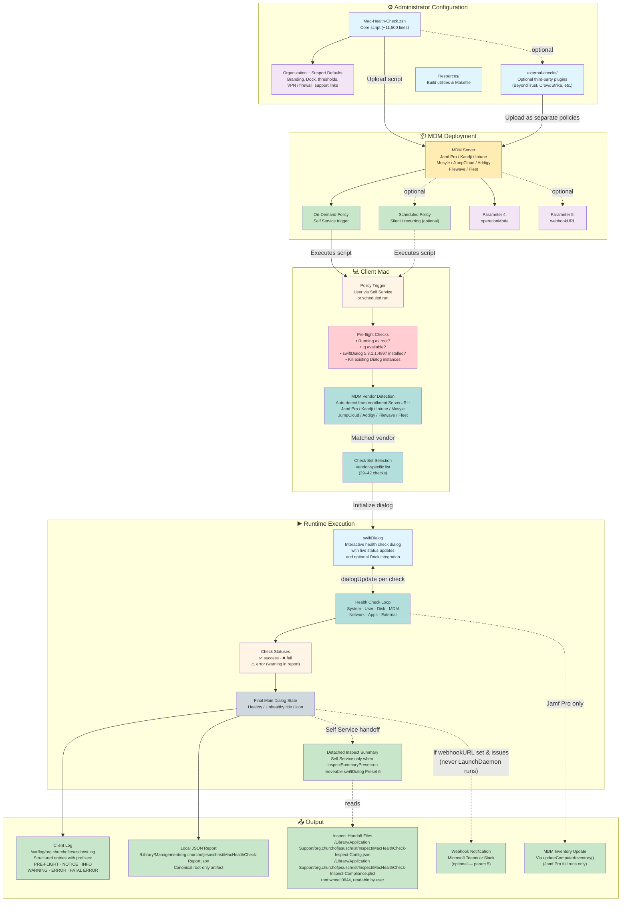

# Mac Health Check: System Architecture

This diagram shows the `5.0.0` Mac Health Check ecosystem, from administrator customization through MDM deployment, client-side execution, user interaction, and results output.

```mermaid
graph TB
    subgraph Admin["⚙️ Administrator Configuration"]
        SCRIPT["Mac-Health-Check.zsh<br>Core script (~11,500 lines)"]
        ORGVARS["Organization + Support Defaults<br>Branding, Dock, thresholds,<br>VPN / firewall, support links"]
        EXTCHECKS["external-checks/<br>Optional third-party plugins<br>(BeyondTrust, CrowdStrike, etc.)"]
        RESOURCES["Resources/<br>Build utilities & Makefile"]

        SCRIPT --> ORGVARS
        SCRIPT -.->|optional| EXTCHECKS

        style SCRIPT fill:#e1f5ff
        style ORGVARS fill:#f3e5f5
        style EXTCHECKS fill:#e1f5ff
        style RESOURCES fill:#e1f5ff
    end

    subgraph MDM["📦 MDM Deployment"]
        MDMSERVER["MDM Server<br>Jamf Pro / Kandji / Intune<br>Mosyle / JumpCloud / Addigy<br>Filewave / Fleet"]
        POLICY["On-Demand Policy<br>Self Service trigger"]
        SILENT["Scheduled Policy<br>Silent / recurring (optional)"]
        PARAM4["Parameter 4:<br>operationMode"]
        PARAM5["Parameter 5:<br>webhookURL"]

        SCRIPT -->|Upload script| MDMSERVER
        EXTCHECKS -->|Upload as separate policies| MDMSERVER
        MDMSERVER --> POLICY
        MDMSERVER -.->|optional| SILENT
        MDMSERVER --> PARAM4
        MDMSERVER -.->|optional| PARAM5

        style MDMSERVER fill:#ffecb3
        style POLICY fill:#c8e6c9
        style SILENT fill:#c8e6c9
        style PARAM4 fill:#f3e5f5
        style PARAM5 fill:#f3e5f5
    end

    subgraph Client["💻 Client Mac"]
        TRIGGER["Policy Trigger<br>User via Self Service<br>or scheduled run"]
        PREFLIGHT["Pre-flight Checks<br>• Running as root?<br>• jq available?<br>• swiftDialog ≥ 3.1.1.4997 installed?<br>• Kill existing Dialog instances"]
        MDMDETECT["MDM Vendor Detection<br>Auto-detect from enrollment ServerURL:<br>Jamf Pro / Kandji / Intune / Mosyle<br>JumpCloud / Addigy / Filewave / Fleet"]
        CHECKLIST["Check Set Selection<br>Vendor-specific list<br>(29–42 checks)"]

        POLICY -->|Executes script| TRIGGER
        SILENT -.->|Executes script| TRIGGER
        TRIGGER --> PREFLIGHT
        PREFLIGHT --> MDMDETECT
        MDMDETECT -->|Matched vendor| CHECKLIST

        style TRIGGER fill:#fff4e6
        style PREFLIGHT fill:#ffcdd2
        style MDMDETECT fill:#b2dfdb
        style CHECKLIST fill:#b2dfdb
    end

    subgraph Runtime["▶️ Runtime Execution"]
        DIALOG["swiftDialog<br>Interactive health check dialog<br>with live status updates<br>and optional Dock integration"]
        CHECKLOOP["Health Check Loop<br>System · User · Disk · MDM<br>Network · Apps · External"]
        STATUSES["Check Statuses<br>✅ success · ❌ fail<br>⚠️ error (warning in report)"]
        FINAL["Final Main Dialog State<br>Healthy / Unhealthy title / icon"]
        INSPECT["Detached Inspect Summary<br>Self Service only when inspectSummaryPreset=on<br>moveable swiftDialog Preset 6"]

        CHECKLIST -->|Initialize dialog| DIALOG
        DIALOG <-->|dialogUpdate per check| CHECKLOOP
        CHECKLOOP --> STATUSES
        STATUSES --> FINAL
        FINAL -.->|Self Service handoff| INSPECT

        style DIALOG fill:#e1f5ff
        style CHECKLOOP fill:#b2dfdb
        style STATUSES fill:#fff4e6
        style FINAL fill:#cfd8dc
        style INSPECT fill:#c8e6c9
    end

    subgraph Output["📤 Output"]
        LOG["Client Log<br>/var/log/org.churchofjesuschrist.log<br>Structured entries with prefixes:<br>PRE-FLIGHT · NOTICE · INFO<br>WARNING · ERROR · FATAL ERROR"]
        REPORT["Local JSON Report<br>/Library/Management/org.churchofjesuschrist/MacHealthCheck-Report.json<br>Canonical root-only artifact"]
        INSPECTFILES["Inspect Handoff Files<br>/Library/Application Support/org.churchofjesuschrist/Inspect/MacHealthCheck-Inspect-Config.json<br>/Library/Application Support/org.churchofjesuschrist/Inspect/MacHealthCheck-Inspect-Compliance.plist<br>root:wheel 0644, readable by user"]
        WEBHOOK["Webhook Notification<br>Microsoft Teams or Slack<br>(optional — param 5)"]
        INVENTORY["MDM Inventory Update<br>Via updateComputerInventory()<br>(Jamf Pro full runs only)"]

        FINAL --> LOG
        FINAL --> REPORT
        INSPECT -.->|reads| INSPECTFILES
        FINAL -.->|"if webhookURL set & issues<br>(never LaunchDaemon runs)"| WEBHOOK
        CHECKLOOP -.->|Jamf Pro only| INVENTORY

        style LOG fill:#c8e6c9
        style REPORT fill:#c8e6c9
        style INSPECTFILES fill:#c8e6c9
        style WEBHOOK fill:#c8e6c9
        style INVENTORY fill:#c8e6c9
    end

    classDef default font-size:11px
```

---

## Component Descriptions

### Administrator Configuration

**`Mac-Health-Check.zsh`**
The single deployable artifact (~11,500 lines). Contains the health check logic, swiftDialog UI layer, Dock handling, logging helpers, webhook delivery, and vendor-specific branching. Administrators typically customize the **Organization Variables** and **IT Support Variables** sections before uploading it to MDM.

**Organization + Support Defaults**
Key settings administrators configure before deployment:
- `organizationBrandingBannerURL` / `organizationOverlayiconURL` — Branding
- `enableDockIntegration` / `dockIcon` — Dock launch behavior and badge icon
- `vpnClientVendor` — VPN type (`paloalto`, `cisco`, `tailscale`, `none`)
- `organizationFirewall` — Firewall type (`socketfilterfw` or `pf`)
- `allowedMinimumFreeDiskPercentage` — Free disk threshold
- `allowedUptimeMinutes` — Uptime warning threshold
- `supportLabel1`–`supportLabel6` / `supportValue1`–`supportValue6` — Dynamic support lines and Info button target
- `completionTimer` — Dialog auto-close delay for the fallback countdown path

**`external-checks/`**
Optional plugin scripts for third-party tools (BeyondTrust, Cisco Umbrella, CrowdStrike Falcon, GlobalProtect, and others). Each plugin is uploaded to Jamf Pro as a separate policy. Most plugins print a keyword result (for example `Running` or `Failed`) that the main script parses; only the Microsoft Defender and Tenable (Alternate) samples write results to the shared defaults domain (`organizationDefaultsDomain`).

---

### MDM Deployment

Mac Health Check is MDM-agnostic and has been tested with eight MDM platforms. The script is uploaded as a policy script and executed with optional runtime and reporting parameters:

- **Parameter 4 (`operationMode`)** — Intended production default is `Self Service`; other supported modes are `Silent`, `Debug`, `Development`, and `Test`
- **Parameter 5 (`webhookURL`)** — Optional Microsoft Teams or Slack webhook URL used when runs with health issues need to post an issue summary; rejected unless `allowParameterSecrets="true"` (prefer `webhookURL` in the root-only `MacHealthCheck-Secrets.plist`)
- **Parameters 6-10** — Optional Splunk reporting inputs for reporting mode, HEC URL, HEC token, HEC index, and HEC sourcetype
- **Parameter 11 (`forceFreshRun`)** — Optional one-shot override that bypasses `Self Service` targeted verification / replay and the `Silent` + `splunkOperationMode=production` cached Splunk upload, forcing a complete fresh health-check run

---

### Client Mac

**Pre-flight Checks**
The script validates its environment before running any health checks:
1. Confirms execution as root
2. Verifies `jq` is available for JSON validation and formatting; exits during pre-flight if it is missing
3. Checks for swiftDialog ≥ 3.1.1.4997, while avoiding redundant production downloads when the installed release already matches the latest production build
4. Kills any existing swiftDialog instances

**MDM Vendor Detection**
The script reads the MDM `ServerURL` from installed configuration profiles to identify the MDM vendor, then selects the appropriate health check set (29–42 checks depending on vendor capabilities).

---

### Runtime Execution

Health checks execute sequentially, with each result posted to the swiftDialog dialog via a named pipe (`dialogUpdate`) in non-`Silent` modes and captured with a stable key plus completion timestamp. `Self Service` validates the canonical report after constructing the current vendor list. Matching reports with a full-run baseline under 36 hours and non-healthy keys produce a compact targeted dialog and rerun only those checks; all ambiguous, stale or incompatible state falls back to the full list. Targeted results merge into the previous full-state report, preserving untouched checks and the original full-baseline age. If another run updates the canonical report during targeted verification, the final merge rebases onto that compatible current report or preserves it and asks for a full run. `Self Service` and full `Silent` runs generate Inspect assets from finalized full-state results. Healthy `Self Service` reports can replay a cached summary while the handoff remains younger than `inspectReplayMaximumAgeSeconds`; unresolved findings take precedence and are verified instead.

---

### Output

**Client Log** — Every run writes structured log entries to `/var/log/org.churchofjesuschrist.log` using prefixed log levels (`[PRE-FLIGHT]`, `[NOTICE]`, `[INFO]`, `[WARNING]`, `[ERROR]`, `[FATAL ERROR]`). Logs include computer name, serial number, user, OS version, and all check results.

**JSON Report** — Every run writes the canonical report artifact to `/Library/Management/org.churchofjesuschrist/MacHealthCheck-Report.json` with root-only permissions. Full reports record `metadata.runScope=full`, full-run baseline fields and per-check timestamps. Targeted reports use a shared lock, atomically replace selected checks by stable key, recompute the full summary, record `summary.recheckedCount`, and retain the original full-run timestamp so verification cannot prolong stale baseline data. Optional Splunk HEC delivery wraps only this validated full-state report.

**Memory Pressure History** — Full health-check runs and targeted memory-pressure rechecks append a root-only observation to `${organizationDirectory}/MacHealthCheck-MemoryPressure-History.jsonl`, retaining 14 days by default. Two distinct local days with yellow or red pressure within seven days produce a warning-only `memoryPressure` check result. Cached Splunk uploads and healthy Inspect replay use existing observations without sampling.

**Client-Side Cache** — `Self Service`, `Debug` and `Silent` + `splunkOperationMode=production` runs on any MDM (never `Test` or `Development`, and only when the running script is a root-owned file in root-controlled directories) install `/Library/Management/org.churchofjesuschrist/MHC.zsh` plus `/Library/LaunchDaemons/org.churchofjesuschrist.MHC.plist`. The script validates the generated plist, loads it as a root LaunchDaemon without `RunAtLoad`, routes daemon stdout/stderr to `/dev/null`, and sets `launchDaemonRun=true` for scheduled executions. The LaunchDaemon starts at 00:53; the client-side copy applies deterministic hardware-derived jitter so runs land in the 00:53-01:53 window centered on 1:23 a.m. It runs in `Silent` mode with `splunkOperationMode=test`, refreshing the JSON report without sending it to Splunk (Splunk secrets live in the root-only `MacHealthCheck-Secrets.plist`; Jamf Pro policy Parameters 5 and 8 are rejected unless `allowParameterSecrets="true"`). If no GUI user is active during a LaunchDaemon refresh, user-scoped checks fall back to loginwindow `lastUserName`. The install runs before the cached-upload decision. A later `Silent` + `splunkOperationMode=production` run (any MDM) normally uploads that cached JSON when the client/server versions match and the report is younger than 36 hours, but operators can bypass that shortcut with Parameter 11 `forceFreshRun=true` or `/var/tmp/MacHealthCheck-Force-Fresh-Run` to force a complete fresh run and overwrite the local report before Splunk delivery.

**Inspect Summary** — `Self Service` and full `Silent` health-check runs generate readable handoff files at `/Library/Application Support/org.churchofjesuschrist/Inspect/MacHealthCheck-Inspect-Config.json` and `/Library/Application Support/org.churchofjesuschrist/Inspect/MacHealthCheck-Inspect-Compliance.plist`. Targeted runs hydrate these assets from the merged full-state report and identify the recent recheck versus older full baseline. `Self Service` launches the detached, moveable Preset 6 summary during the retained main-dialog countdown and replays it only when the canonical report is healthy and the handoff is younger than `inspectReplayMaximumAgeSeconds`. `Silent` writes assets without launching swiftDialog.

**Webhook** — When configured, a summary of warning, failed, or errored checks is posted to Microsoft Teams or Slack at the end of each run with health issues. Client-Side Cache LaunchDaemon runs never send webhooks, and targeted rechecks whose results are unchanged from the previous report skip them. Jamf Pro deployments include a direct link to the computer record.

**MDM Inventory** — Jamf Pro full check runs include `updateComputerInventory()` as the final Jamf-specific check. Jamf `Silent` + Splunk production runs and Client-Side Cache LaunchDaemon runs skip inventory submission.
