# Mac Health Check: System Architecture

This diagram shows the complete Mac Health Check ecosystem — from an administrator customizing the script through MDM deployment, client-side execution, user interaction, and results output.

```mermaid
graph TB
    subgraph Admin["⚙️ Administrator Configuration"]
        SCRIPT["Mac-Health-Check.zsh<br>Core script (4,500+ lines)"]
        ORGVARS["Organization Defaults<br>Branding, thresholds, VPN type,<br>firewall type, webhook URL"]
        EXTCHECKS["external-checks/<br>Optional third-party plugins<br>(BeyondTrust, CrowdStrike, etc.)"]
        RESOURCES["Resources/<br>Build utilities & Makefile"]

        SCRIPT --> ORGVARS
        SCRIPT -.->|optional| EXTCHECKS

        style SCRIPT fill:#e1f5ff
        style ORGVARS fill:#f3e5f5
        style EXTCHECKS fill:#e1f5ff
        style RESOURCES fill:#e1f5ff
    end

    subgraph MDM["📦 MDM Deployment"]
        MDMSERVER["MDM Server<br>Jamf Pro / Kandji / Intune<br>Mosyle / JumpCloud / Addigy<br>Filewave / Fleet"]
        POLICY["On-Demand Policy<br>Self Service trigger"]
        SILENT["Scheduled Policy<br>Silent / recurring (optional)"]
        PARAM4["Parameter 4:<br>operationMode"]
        PARAM5["Parameter 5:<br>webhookURL"]

        SCRIPT -->|Upload script| MDMSERVER
        EXTCHECKS -->|Upload as separate policies| MDMSERVER
        MDMSERVER --> POLICY
        MDMSERVER -.->|optional| SILENT
        MDMSERVER --> PARAM4
        MDMSERVER -.->|optional| PARAM5

        style MDMSERVER fill:#ffecb3
        style POLICY fill:#c8e6c9
        style SILENT fill:#c8e6c9
        style PARAM4 fill:#f3e5f5
        style PARAM5 fill:#f3e5f5
    end

    subgraph Client["💻 Client Mac"]
        TRIGGER["Policy Trigger<br>User via Self Service<br>or scheduled run"]
        PREFLIGHT["Pre-flight Checks<br>• Running as root?<br>• swiftDialog ≥ 3.0.0.4934 installed?<br>• jq installed?<br>• Kill existing Dialog instances"]
        MDMDETECT["MDM Vendor Detection<br>Auto-detect from installed profiles:<br>Jamf Pro / Kandji / Intune / Mosyle<br>JumpCloud / Addigy / Filewave / Fleet"]
        CHECKLIST["Check Set Selection<br>Vendor-specific list<br>(28–37 checks)"]

        POLICY -->|Executes script| TRIGGER
        SILENT -.->|Executes script| TRIGGER
        TRIGGER --> PREFLIGHT
        PREFLIGHT --> MDMDETECT
        MDMDETECT -->|Matched vendor| CHECKLIST

        style TRIGGER fill:#fff4e6
        style PREFLIGHT fill:#ffcdd2
        style MDMDETECT fill:#b2dfdb
        style CHECKLIST fill:#b2dfdb
    end

    subgraph Runtime["▶️ Runtime Execution"]
        DIALOG["swiftDialog<br>Interactive health check dialog<br>with live status updates"]
        CHECKLOOP["Health Check Loop<br>System · User · Disk · MDM<br>Network · Apps · External"]
        STATUSES["Check Statuses<br>✅ pass · ⚠️ warning<br>❌ error · ⏭️ skipped"]
        TIMER["Completion Timer<br>Auto-close after N seconds<br>(default: 60)"]

        CHECKLIST -->|Initialize dialog| DIALOG
        DIALOG <-->|dialogUpdate per check| CHECKLOOP
        CHECKLOOP --> STATUSES
        STATUSES --> TIMER

        style DIALOG fill:#e1f5ff
        style CHECKLOOP fill:#b2dfdb
        style STATUSES fill:#fff4e6
        style TIMER fill:#cfd8dc
    end

    subgraph Output["📤 Output"]
        LOG["Client Log<br>/var/log/org.example.log<br>Structured entries with prefixes:<br>PRE-FLIGHT · NOTICE · INFO<br>WARNING · ERROR · FATAL"]
        WEBHOOK["Webhook Notification<br>Microsoft Teams or Slack<br>(optional — param 5)"]
        INVENTORY["MDM Inventory Update<br>Via updateComputerInventory()<br>(Jamf Pro only)"]

        TIMER --> LOG
        TIMER -.->|if webhookURL set| WEBHOOK
        TIMER -.->|Jamf Pro only| INVENTORY

        style LOG fill:#c8e6c9
        style WEBHOOK fill:#c8e6c9
        style INVENTORY fill:#c8e6c9
    end

    classDef default font-size:11px
```

---

## Component Descriptions

### Administrator Configuration

**`Mac-Health-Check.zsh`**
The single deployable artifact (4,500+ lines). Contains all health check logic, the swiftDialog UI layer, logging helpers, and the webhook integration. Administrators customize the **Organization Defaults** block (lines 90–172) before uploading to MDM.

**Organization Defaults**
Key settings administrators configure before deployment:
- `organizationBrandingBannerURL` / `organizationOverlayiconURL` — Branding
- `vpnClientVendor` — VPN type (`paloalto`, `cisco`, `tailscale`, `none`)
- `organizationFirewall` — Firewall type (`socketfilterfw` or `pf`)
- `allowedMinimumFreeDiskPercentage` — Free disk threshold
- `allowedUptimeMinutes` — Uptime warning threshold
- `completionTimer` — Dialog auto-close delay

**`external-checks/`**
Optional plugin scripts for third-party tools (BeyondTrust, Cisco Umbrella, CrowdStrike Falcon, GlobalProtect). Each plugin is uploaded to MDM as a separate policy and writes results to a shared defaults domain (`organizationDefaultsDomain`) for the main script to read.

---

### MDM Deployment

Mac Health Check is MDM-agnostic and has been tested with eight MDM platforms. The script is uploaded as a policy script and executed with two optional parameters:

- **Parameter 4 (`operationMode`)** — Controls UI behavior: `Self Service` (default), `Silent`, `Debug`, `Development`, or `Test`
- **Parameter 5 (`webhookURL`)** — Optional Microsoft Teams or Slack webhook URL for failure notifications

---

### Client Mac

**Pre-flight Checks**
The script validates its environment before running any health checks:
1. Confirms execution as root
2. Verifies `jq` is installed
3. Checks for swiftDialog ≥ 3.0.0.4934 (installs from GitHub if missing)
4. Kills any existing swiftDialog instances

**MDM Vendor Detection**
The script inspects installed configuration profiles to identify the MDM vendor, then selects the appropriate health check set (28–37 checks depending on vendor capabilities).

---

### Runtime Execution

Health checks execute sequentially, with each result posted to the swiftDialog dialog via a named pipe (`dialogUpdate`). Checks report one of four statuses: **pass**, **warning**, **error**, or **skipped**. After all checks complete, a final summary dialog appears with a countdown timer.

---

### Output

**Client Log** — Every run writes structured log entries to `/var/log/` using prefixed log levels (`[PRE-FLIGHT]`, `[NOTICE]`, `[INFO]`, `[WARNING]`, `[ERROR]`, `[FATAL ERROR]`). Logs include computer name, serial number, user, OS version, and all check results.

**Webhook** — When configured, a summary of failed checks is posted to Microsoft Teams or Slack at the end of each run. Jamf Pro deployments include a direct link to the computer record.

**MDM Inventory** — Jamf Pro deployments can trigger a recon at the end of each run via `updateComputerInventory()`.
