# Mac Health Check: Script Execution Flow

This flowchart documents the `5.0.0` decision logic executed each time Mac Health Check runs, from the initial invocation through pre-flight validation, health check execution, and final output.

```mermaid
graph TB
    START(["▶ Script Invoked<br>via MDM policy or local test"])

    subgraph Params["📋 Parameter Parsing"]
        P4["Parameter 4:<br>operationMode<br>intended default: 'Self Service'"]
        P5["Parameter 5:<br>webhookURL<br>default: empty"]
        P6["Parameter 6:<br>splunkOperationMode<br>default: test"]

        style P4 fill:#f3e5f5
        style P5 fill:#f3e5f5
        style P6 fill:#f3e5f5
    end

    subgraph Mode["🔀 Operation Mode Check"]
        ISDEBUG{"operationMode<br>== 'Debug' ?"}
        SETX["Enable set -x<br>(verbose shell tracing)"]

        ISDEBUG -->|Yes| SETX

        style ISDEBUG fill:#ffecb3
        style SETX fill:#ffcdd2
    end

    subgraph ClientSideCache["Client-Side Cache"]
        CSCCHECK{"Silent + Splunk production run?<br>(any MDM)"}
        FORCEFRESH{"Parameter 11 forceFreshRun=true<br>or root-owned trigger file present?"}
        CSCSKIP{"Not running from client-side path,<br>client script version matches<br>and cached report valid and < 36h old?"}
        FORCEFULL["Remove trigger file when present<br>delete cached JSON report<br>bypass cached-upload shortcut"]
        CSCSHORTCUT["Set clientSideSkipChecks=true<br>for cached Splunk upload"]

        CSCCHECK -->|Yes| FORCEFRESH
        FORCEFRESH -->|Yes| FORCEFULL
        FORCEFRESH -->|No| CSCSKIP
        CSCSKIP -->|Yes| CSCSHORTCUT

        style CSCCHECK fill:#ffecb3
        style FORCEFRESH fill:#ffecb3
        style FORCEFULL fill:#ffe0b2
        style CSCSKIP fill:#ffecb3
        style CSCSHORTCUT fill:#c8e6c9
    end

    subgraph PreFlight["✈️ Pre-flight Checks"]
        PREFLIGHT_START["Initialize client log<br>/var/log/org.churchofjesuschrist.log"]
        ROOTCHECK{"Running as root?"}
        JSONTOOLS["Require root-owned jq<br>for JSON validation,<br>formatting, and merge helpers"]
        INSTALLCHECK{"Not Test / Development, and<br>non-Silent or Silent + Splunk production?"}
        INSTALLCACHE["Install or update client-side script<br>sanitize Jamf inventory code, verify zsh -n<br>validate and load LaunchDaemon"]
        CACHEDUPLOADCHECK{"clientSideSkipChecks<br>== true?"}
        CACHEDUPLOAD["Validate cached report again<br>wrap existing JSON in HEC payload<br>upload to Splunk and exit"]
        SDSILENT{"operationMode<br>== 'Silent' ?"}
        SDCHECK{"swiftDialog<br>≥ 3.1.1.4997?"}
        SDINSTALL["Download & install<br>swiftDialog from GitHub<br>(Team ID verified)"]
        KILLSD["Kill existing<br>Dialog instances"]
        PREFLIGHTDONE["Pre-flight complete"]

        PREFLIGHT_START --> ROOTCHECK
        ROOTCHECK -->|No| FATAL1(["💀 Fatal Error:<br>Not running as root"])
        ROOTCHECK -->|Yes| JSONTOOLS
        JSONTOOLS --> INSTALLCHECK
        INSTALLCHECK -->|Yes| INSTALLCACHE
        INSTALLCHECK -->|No| CACHEDUPLOADCHECK
        INSTALLCACHE --> CACHEDUPLOADCHECK
        CACHEDUPLOADCHECK -->|Yes| CACHEDUPLOAD
        CACHEDUPLOADCHECK -->|No| SDSILENT
        SDSILENT -->|"Yes (skip swiftDialog)"| PREFLIGHTDONE
        SDSILENT -->|No| SDCHECK
        SDCHECK -->|No| SDINSTALL
        SDINSTALL --> KILLSD
        SDCHECK -->|Yes| KILLSD
        KILLSD --> PREFLIGHTDONE

        style PREFLIGHT_START fill:#b2dfdb
        style ROOTCHECK fill:#ffecb3
        style JSONTOOLS fill:#e1f5ff
        style INSTALLCHECK fill:#ffecb3
        style INSTALLCACHE fill:#fff4e6
        style CACHEDUPLOADCHECK fill:#ffecb3
        style CACHEDUPLOAD fill:#c8e6c9
        style SDSILENT fill:#ffecb3
        style SDCHECK fill:#ffecb3
        style SDINSTALL fill:#fff4e6
        style KILLSD fill:#fff4e6
        style PREFLIGHTDONE fill:#b2dfdb
        style FATAL1 fill:#ffcdd2
    end

    subgraph MDMDetect["🔍 List Item Selection"]
        LISTMODE{"operationMode<br>== 'Development' ?"}
        DEVLIST["Development subset<br>Clock Skew · Memory Pressure<br>Apple Push Notification service"]
        DETECTMDM["MDM vendor detected at startup<br>from enrollment ServerURL"]
        MDMVENDOR{"MDM Vendor<br>Identified?"}
        JAMF["Jamf Pro<br>42 checks"]
        KANDJI["Kandji<br>32 checks"]
        INTUNE["Microsoft Intune<br>33 checks"]
        MOSYLE["Mosyle<br>34 checks"]
        JUMPCLOUD["JumpCloud<br>33 checks"]
        OTHERS["Addigy / Fleet<br>33 checks<br>Filewave<br>32 checks"]
        GENERIC["Generic baseline<br>29 checks"]

        LISTMODE -->|Yes| DEVLIST
        LISTMODE -->|No| DETECTMDM
        DETECTMDM --> MDMVENDOR
        MDMVENDOR -->|Jamf Pro| JAMF
        MDMVENDOR -->|Kandji| KANDJI
        MDMVENDOR -->|Intune| INTUNE
        MDMVENDOR -->|Mosyle| MOSYLE
        MDMVENDOR -->|JumpCloud| JUMPCLOUD
        MDMVENDOR -->|Addigy / Fleet / Filewave| OTHERS
        MDMVENDOR -->|Other / None| GENERIC

        style LISTMODE fill:#ffecb3
        style DEVLIST fill:#fff4e6
        style DETECTMDM fill:#b2dfdb
        style MDMVENDOR fill:#ffecb3
        style JAMF fill:#c8e6c9
        style KANDJI fill:#c8e6c9
        style INTUNE fill:#c8e6c9
        style MOSYLE fill:#c8e6c9
        style JUMPCLOUD fill:#c8e6c9
        style OTHERS fill:#c8e6c9
        style GENERIC fill:#c8e6c9
    end

    subgraph Targeted["🎯 Self Service Targeted Recheck & Replay"]
        TARGETCHECK{"Self Service canonical report valid,<br>matching and full baseline < 36h<br>with non-healthy check keys?"}
        TARGETPREP["Filter dialog to selected keys<br>map original indexes to compact indexes"]
        REPLAYCHECK{"Healthy canonical report + inspectSummaryPreset=on<br>cached inspect config age<br>< inspectReplayMaximumAgeSeconds and valid?"}
        REPLAYLAUNCH["Launch cached moveable Preset 6 summary<br>skip checks and exit"]

        TARGETCHECK -->|Yes| TARGETPREP
        TARGETCHECK -->|No| REPLAYCHECK
        REPLAYCHECK -->|Yes| REPLAYLAUNCH

        style TARGETCHECK fill:#ffecb3
        style TARGETPREP fill:#fff4e6
        style REPLAYCHECK fill:#ffecb3
        style REPLAYLAUNCH fill:#c8e6c9
    end

    subgraph ModeCheck2["🎛️ Operation Mode Branch"]
        MODESWITCH{"operationMode?"}
        ISSILENT["Silent Mode<br>Skip main dialog — log only"]
        ISDEV["Development Mode<br>Run curated three-check subset<br>in normal dialog flow"]
        ISTEST["Test Mode<br>Simulate current vendor list items<br>without running real checks"]
        NORMAL["Self Service / Debug<br>Full or targeted interactive run"]

        MODESWITCH -->|"Silent"| ISSILENT
        MODESWITCH -->|"Development"| ISDEV
        MODESWITCH -->|"Test"| ISTEST
        MODESWITCH -->|Self Service / Debug| NORMAL

        style MODESWITCH fill:#ffecb3
        style ISSILENT fill:#cfd8dc
        style ISDEV fill:#fff4e6
        style ISTEST fill:#fff4e6
        style NORMAL fill:#e1f5ff
    end

    subgraph CheckLoop["🔄 Health Check Execution Loop"]
        INITDIALOG["Launch swiftDialog<br>Dock-named app and initial badge<br>when enableDockIntegration=true"]
        RUNCHECK["Execute next check<br>in selected check set"]
        DIALOGUPDATE["dialogUpdate:<br>Record result; post to swiftDialog<br>when not Silent<br>(success / fail / error)"]
        MORECHECKS{"More checks<br>remaining?"}

        INITDIALOG --> RUNCHECK
        RUNCHECK --> DIALOGUPDATE
        DIALOGUPDATE --> MORECHECKS
        MORECHECKS -->|Yes| RUNCHECK

        style INITDIALOG fill:#e1f5ff
        style RUNCHECK fill:#b2dfdb
        style DIALOGUPDATE fill:#b2dfdb
        style MORECHECKS fill:#ffecb3
    end

    subgraph Final["🏁 Final State & Output"]
        FINALSTATE["Evaluate overall compliance<br>Update dialog to final state"]
        FAILURES{"Health issues detected?"}
        WEBHOOK{"Jamf Pro + webhookURL configured?<br>(never LaunchDaemon runs or<br>unchanged targeted rechecks)"}
        SENDWEBHOOK["Post issue summary to Teams or Slack<br>with View in Jamf Pro link"]
        REPORT["Write canonical local JSON report<br>and optional Splunk HEC payload<br>(Test / Development: MacHealthCheck-Report-Test.json<br>or -Development.json only; no HEC)"]
        COMPLETIONUI{"Non-Silent mode?"}
        INSPECTHANDOFF{"Self Service + inspectSummaryPreset=on<br>inspect handoff succeeds?"}
        INSPECT["Launch detached moveable Preset 6 summary<br>retain main dialog countdown"]
        COMPLETIONTIMER["Display completion timer<br>enable Close button"]
        CLEANUP["Remove this run's temp files<br>Non-Silent: clear Dock badge, remove<br>Dock-named copy this run created<br>and /var/tmp/dialog.log"]
        EXIT(["⏹ Script Exits"])

        FINALSTATE --> FAILURES
        FAILURES -->|Yes| WEBHOOK
        FAILURES -->|No| REPORT
        WEBHOOK -->|Yes| SENDWEBHOOK
        WEBHOOK -->|No| REPORT
        SENDWEBHOOK --> REPORT
        REPORT --> COMPLETIONUI
        COMPLETIONUI -->|Yes| INSPECTHANDOFF
        COMPLETIONUI -->|"No (Silent writes Inspect assets)"| CLEANUP
        INSPECTHANDOFF -->|Yes| INSPECT
        INSPECTHANDOFF -->|No| COMPLETIONTIMER
        INSPECT --> COMPLETIONTIMER
        COMPLETIONTIMER --> CLEANUP
        CLEANUP --> EXIT

        style FINALSTATE fill:#b2dfdb
        style FAILURES fill:#ffecb3
        style WEBHOOK fill:#ffecb3
        style SENDWEBHOOK fill:#c8e6c9
        style REPORT fill:#c8e6c9
        style COMPLETIONUI fill:#ffecb3
        style INSPECTHANDOFF fill:#ffecb3
        style INSPECT fill:#c8e6c9
        style COMPLETIONTIMER fill:#cfd8dc
        style CLEANUP fill:#c8e6c9
    end

    %% Cross-subgraph edges (kept outside subgraph blocks so each node renders in its own subgraph)
    START --> P4
    START --> P5
    START --> P6
    P4 --> ISDEBUG
    SETX --> CSCCHECK
    ISDEBUG -->|No| CSCCHECK
    CSCCHECK -->|No| PREFLIGHT_START
    FORCEFULL --> PREFLIGHT_START
    CSCSKIP -->|No| PREFLIGHT_START
    CSCSHORTCUT --> PREFLIGHT_START
    PREFLIGHTDONE --> LISTMODE
    DEVLIST --> TARGETCHECK
    JAMF --> TARGETCHECK
    KANDJI --> TARGETCHECK
    INTUNE --> TARGETCHECK
    MOSYLE --> TARGETCHECK
    JUMPCLOUD --> TARGETCHECK
    OTHERS --> TARGETCHECK
    GENERIC --> TARGETCHECK
    TARGETPREP --> MODESWITCH
    REPLAYCHECK -->|No| MODESWITCH
    NORMAL --> INITDIALOG
    ISTEST --> INITDIALOG
    ISDEV --> INITDIALOG
    ISSILENT --> RUNCHECK
    MORECHECKS -->|No| FINALSTATE
    CACHEDUPLOAD --> EXIT
    REPLAYLAUNCH --> EXIT

    classDef default font-size:11px
```

---

## Key Decision Points

### 1. Operation Mode (Parameter 4)
Set via MDM policy parameter. Determines UI behavior and which checks execute. The intended release default is `Self Service`.

### 2. Root Validation
The script must run as root. If not, it calls `fatal()` and exits immediately with a log entry.

### 3. jq Availability
The script requires a root-owned `jq` (the macOS-bundled `/usr/bin/jq`, or a root-owned copy in `/usr/local/bin` or `/opt/homebrew/bin`) for JSON validation, formatting, and dialog/listitem JSON merging. If no trusted `jq` is available, the script exits during pre-flight with a fatal dependency message.

### 4. swiftDialog Version
The script targets swiftDialog ≥ 3.1.1.4997. If the configured minimum is newer than the latest production package, pre-flight skips the redundant download when the installed version already matches or exceeds that latest production release. Only non-`Silent` modes validate or install swiftDialog and quit other running Dialog instances; `Silent` skips both. A downloaded package whose Team ID does not match swiftDialog's exits `1` after an AppleScript alert, and failed downloads or installs exit through `fatal()`.

### 5. Dock Integration
If `enableDockIntegration` is `true` and the mode is not `Silent`, the script resolves the Dock icon, attempts a named `Dialog.app` launch so Dock hover text matches the script name, initializes `dockiconbadge`, and falls back to the standard dialog binary if the Dock-enabled launch fails. At exit, non-`Silent` runs remove the Dock-named copy only when this run created it, plus `/var/tmp/dialog.log`; `Silent` cleanup leaves both in place so a concurrent interactive run is not disturbed. The Dock-named copy is re-signed ad hoc, which drops swiftDialog's Team ID; set `enableDockIntegration="false"` where PPPC or notification profiles key on swiftDialog's Team ID.

### 6. Client-Side Cache Install and Cached Upload
When any MDM runs the server-side script in `Silent` mode with `splunkOperationMode=production`, the script first checks whether operators forced a full refresh through Parameter 11 `forceFreshRun=true` or a root-owned `/var/tmp/MacHealthCheck-Force-Fresh-Run` (trigger files owned by other users are ignored and removed). If either override is present, it removes the trigger file when present, deletes `/Library/Management/org.churchofjesuschrist/MacHealthCheck-Report.json` if it exists, logs the bypass, and continues into a complete fresh health-check run. Without that override (and when the run is not the client-side copy itself), the script compares the client-side script at `/Library/Management/org.churchofjesuschrist/MHC.zsh` to the running server-side version. If versions match and `/Library/Management/org.churchofjesuschrist/MacHealthCheck-Report.json` is valid and younger than 36 hours, it marks the run for cached upload. After root and `jq` pre-flight checks pass, the script first installs or refreshes the Client-Side Cache copy (`Self Service`, `Debug`, or `Silent` + `production`; never `Test` or `Development`), so content changes reach the nightly copy even without a version bump. Only then does a run marked for cached upload validate the cached report again, wrap that existing JSON in the normal Splunk HEC payload, upload it, and exit without running health checks. Operationally this path is identified by log lines such as `Client-Side Cache: ... cached report is valid and <seconds>s old. Skipping health checks.`, followed by the cached-upload notices and a successful Splunk HEC delivery. The upload timestamp can therefore trail the underlying data-collection timestamp by several hours and, by policy, up to the 36-hour cache window.

### 7. MDM Vendor Detection
Near startup, the script reads the MDM `ServerURL` from installed configuration profiles to identify the MDM platform. After pre-flight, `Development` uses its curated three-check subset (Clock Skew, Memory Pressure and Apple Push Notification service); every other mode uses the vendor's ordered list (Jamf Pro 42, Mosyle 34, Addigy / Fleet / JumpCloud / Intune 33, Filewave / Kandji 32, Generic 29). Addigy, Fleet and Filewave are identified vendors with their own list arrays; only an unrecognized or missing MDM vendor falls through to the generic baseline check set. The list is built before targeted-recheck evaluation, cached replay and dialog launch.

### 8. Individual Check Results
Each health check function records one of three list-item statuses via `dialogUpdate` (and posts it to swiftDialog outside `Silent`):
- `success` — Check succeeded or is not applicable (for example, `N/A (Ethernet)` for Wi-Fi Strength)
- `fail` — Check found a compliance failure
- `error` — Check found a non-critical condition; `normalizeCheckStatus()` records it as `warning` in the JSON report

`checkMemoryPressure()` runs in each full vendor check set, the curated Development subset, and targeted rechecks when its prior result was non-healthy. It records a root-only local history sample, then reports a warning only after adverse pressure on two distinct local days within the seven-day lookback. Insufficient valid history is neutral. Cached Splunk uploads, healthy Inspect replay, and simulated `Test` mode skip sampling.

### 9. Webhook Delivery
If `webhookURL` (from `MacHealthCheck-Secrets.plist`, or Parameter 5 only when `allowParameterSecrets="true"`) is populated and health issues are detected, `quitScript()` posts a JSON payload to Microsoft Teams or Slack summarizing warning, failed, or errored checks. The payload auto-detects the webhook type from the URL, which must use `https://` (other schemes are refused with a `[WARNING]`). Delivery is effectively Jamf Pro-only: `webHookMessage()` adds a `View in Jamf Pro` link for Jamf Pro; the Mosyle branch builds no console URL, so its payload carries an empty `View in Jamf Pro` link and may be rejected; every other MDM vendor returns without sending. Client-Side Cache LaunchDaemon runs (`launchDaemonRun=true`) never send webhooks, and targeted rechecks whose results are unchanged from the previous report skip the message.

### 10. JSON Report + Splunk Delivery
At the end of the run, `generateAndSendSplunkReport()` writes the canonical local JSON report (`Test` and `Development` write only `MacHealthCheck-Report-Test.json` or `MacHealthCheck-Report-Development.json` and skip the canonical report and HEC delivery) and, when `splunkOperationMode=production`, Parameter 7 (HEC URL) and the HEC token from `MacHealthCheck-Secrets.plist` are configured, optionally delivers a Splunk HEC envelope. Full runs write all checks with `metadata.runScope=full`, a full-run timestamp and per-check completion timestamps. Targeted `Self Service` runs replace selected results by stable key, preserve untouched results, recompute the full summary, retain the original full-run baseline age, and send only that merged full-state document to Splunk. Writes validate first, use a shared lock, and atomically replace the root-only report. If the report changes during targeted verification, the merge rebases onto the compatible current report; incompatible changes preserve the current report and ask for a full run. `splunkOperationMode=off` or `test` still generates the report but skips network transmission. Client-Side Cache freshness uses `metadata.fullRunTimestampEpoch` for targeted reports so repeated verification cannot extend an old baseline indefinitely.

### 11. Inspect Summary Assets
In `Self Service` and full `Silent` health-check runs, the script uses finalized results to generate `/Library/Application Support/org.churchofjesuschrist/Inspect/MacHealthCheck-Inspect-Config.json` and `/Library/Application Support/org.churchofjesuschrist/Inspect/MacHealthCheck-Inspect-Compliance.plist`. Targeted runs hydrate the result collector from the merged full-state report before generating these assets, so Inspect still shows all checks and distinguishes the recent rechecks from the older full baseline. `Self Service` launches the detached, moveable swiftDialog Inspect Mode Preset 6 guided summary; `Silent` writes the assets without launching swiftDialog. Set `inspectSummaryPreset="off"` to skip asset generation, detached launch and cached replay.

### 12. Self Service Targeted Recheck and Cached Replay
After building the current vendor list, `Self Service` validates `/Library/Management/org.churchofjesuschrist/MacHealthCheck-Report.json`. A matching report with a full-run baseline less than 36 hours old and non-healthy keys filters the main dialog and reruns only those checks. Force Fresh Run, incompatible state, stale data, reporting-only errors or unmapped keys force all checks. Cached Inspect replay is considered only when the validated canonical report is healthy; unresolved findings always take precedence and are rechecked.

### 13. Final Health State
When health issues are detected, non-`Silent` runs update the main dialog to either `Computer Needs Attention` for warning-only results or `Computer Unhealthy` for failures and errors, then continue through report generation, webhook delivery when configured, and the existing completion flow. In `Self Service` with `inspectSummaryPreset="on"`, the detached inspect summary remains the post-run issue detail surface.

---

## Exit Paths

Exit code `0` means healthy or warnings only; `1` means at least one fail or error (targeted report-merge failures also exit `1`). `Silent` + `splunkOperationMode=production` is reporting-first: it exits `0` only when the local report is written and Splunk HEC delivery succeeds, and `1` otherwise, regardless of findings.

| Path | Trigger | Exit code | Logged? |
|---|---|---|---|
| Rejected Parameter 8 | `Silent` + `splunkOperationMode=production` with a Splunk HEC token supplied only through Parameter 8 (and `allowParameterSecrets` not `true`); exits before MDM discovery and health checks | `1` | Yes (`[ERROR]`) |
| Jamf Pro without `jamf.log` | `ServerURL` identifies Jamf Pro but `/private/var/log/jamf.log` is missing | `1` | No (console only) |
| Fatal: Not root | `EUID != 0` | `1` | Yes (`[FATAL ERROR]`) |
| Fatal: Insecure `organizationDirectory` | `organizationDirectory` cannot be secured as a root-owned directory that is not group- or world-writable | `1` | Yes (`[FATAL ERROR]`) |
| Fatal: Missing `jq` | No trusted root-owned `jq` found | `1` | Yes (`[FATAL ERROR]`) |
| Client-Side Cache upload | Matching client/server version and fresh cached JSON in `Silent` + Splunk production (any MDM), after the client-side install step | `0` on success; `1` when the cached upload fails | Yes |
| swiftDialog Team ID mismatch | Non-`Silent` run downloads a swiftDialog package whose Team ID does not match | `1` | No (AppleScript alert only) |
| Fatal: swiftDialog unavailable | Non-`Silent` run cannot download or install swiftDialog | `1` | Yes (`[FATAL ERROR]`) |
| Normal: Silent | All checks complete, no UI | `0` / `1` per findings (reporting-first rule above for Splunk production) | Yes |
| Normal: Self Service | Detached moveable Preset 6 guided summary launches after report generation and the main dialog still completes its normal countdown | `0` / `1` per findings | Yes |
| Targeted: Self Service remediation verification | Valid recent non-healthy report reruns selected stable keys, merges full-state results and launches refreshed Inspect summary | `0` / `1` per merged findings; `1` on report merge errors | Yes |
| Replay: Self Service healthy cached summary | Healthy canonical report plus fresh inspect config launches cached moveable Preset 6 guided summary and skips the health-check loop | `0` | Yes |
| Normal: Test | Current vendor list items simulated as success | `0` | Yes |
| Normal: Unhealthy non-`Silent` run | Main dialog ends unhealthy; `Self Service` can still launch detached inspect summary | `0` (warnings only) / `1` | Yes |
| Normal: With webhook | Jamf Pro run with health issues posts webhook (never from LaunchDaemon runs) before report generation and final UI cleanup | `0` (warnings only) / `1` | Yes |
