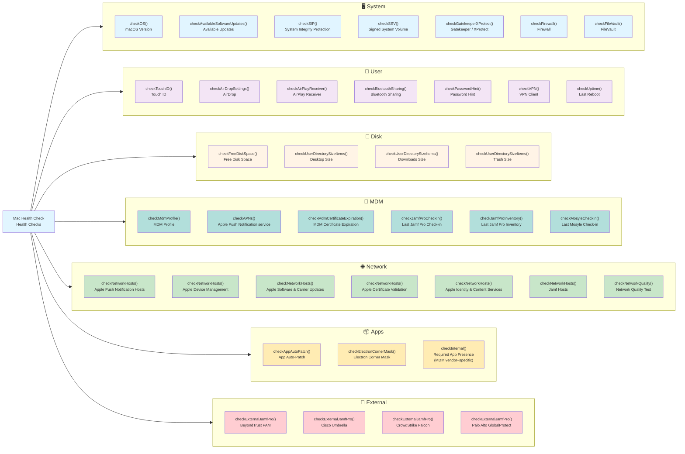

# Mac Health Check: Health Check Categories

This diagram shows all Mac Health Check health checks organized by category. Each check is listed with its function name and the human-readable label shown in the swiftDialog interface.

---

## Category Descriptions

### System
Core macOS security and compliance checks that every deployment should include. These checks verify OS version compliance, pending software updates, kernel-level security features (SIP, SSV), application security controls (Gatekeeper, XProtect), network firewall status, and disk encryption.

| Function | Human-Readable Name | Notes |
|---|---|---|
| `checkOS()` | macOS Version | Compliant if within `previousMinorOS` versions of latest release |
| `checkAvailableSoftwareUpdates()` | Available Updates | Reports count of pending macOS/app updates |
| `checkSIP()` | System Integrity Protection | Checks `csrutil status` |
| `checkSSV()` | Signed System Volume | Checks `csrutil authenticated-root status` |
| `checkGatekeeperXProtect()` | Gatekeeper / XProtect | Validates Gatekeeper status and XProtect version/date |
| `checkFirewall()` | Firewall | Supports `socketfilterfw` (default) or `pf` via `organizationFirewall` |
| `checkFileVault()` | FileVault | Checks FileVault encryption status |

### User
Per-user settings and behavior checks. Some checks (e.g., `checkPasswordHint()`) are MDM vendor–specific and may not appear in all deployments.

| Function | Human-Readable Name | Notes |
|---|---|---|
| `checkTouchID()` | Touch ID | Reports enrolled fingerprints |
| `checkAirDropSettings()` | AirDrop | Warns on "Everyone" setting |
| `checkAirPlayReceiver()` | AirPlay Receiver | Warns if enabled without restriction |
| `checkBluetoothSharing()` | Bluetooth Sharing | Warns if Bluetooth Sharing is enabled |
| `checkPasswordHint()` | Password Hint | Warns if a password hint is set |
| `checkVPN()` | VPN Client | Controlled by `vpnClientVendor`; skipped if `none` |
| `checkUptime()` | Last Reboot | Warns/errors if uptime exceeds `allowedUptimeMinutes` (default: 10,080 min / 7 days) |

### Disk
Storage checks. Thresholds are configurable via organization defaults.

| Function | Human-Readable Name | Notes |
|---|---|---|
| `checkFreeDiskSpace()` | Free Disk Space | Errors if below `allowedMinimumFreeDiskPercentage` (default: 10%) |
| `checkUserDirectorySizeItems()` | Desktop / Downloads / Trash Size | Warns if any user directory exceeds `allowedMaximumDirectoryPercentage` (default: 5%) |

### MDM
MDM connectivity and certificate health checks. Vendor-specific checks (Jamf Pro check-in/inventory, Mosyle check-in) appear only in the matching vendor's check set.

| Function | Human-Readable Name | Notes |
|---|---|---|
| `checkMdmProfile()` | MDM Profile | Verifies MDM enrollment profile is present |
| `checkAPNs()` | Apple Push Notification service | Validates APNs connectivity |
| `checkMdmCertificateExpiration()` | MDM Certificate Expiration | Warns 30 days before expiration |
| `checkJamfProCheckIn()` | Last Jamf Pro Check-in | Jamf Pro only |
| `checkJamfProInventory()` | Last Jamf Pro Inventory | Jamf Pro only |
| `checkMosyleCheckIn()` | Last Mosyle Check-in | Mosyle only |

### Network
Validates reachability to Apple infrastructure and (for Jamf Pro) Jamf Cloud hosts. `checkNetworkQuality()` runs an `networkQuality` speed test, caching results for up to `networkQualityTestMaximumAge` (default: 1 hour) to avoid repeated tests.

### Apps
Application-specific checks. `checkInternal()` validates the presence of an MDM vendor–specific companion app (e.g., Company Portal for Intune, Self-Service.app for Mosyle). `checkAppAutoPatch()` validates the App Auto-Patch patching agent.

### External
Optional plugin checks for third-party security tools. These require separate MDM policies from the `external-checks/` directory and use a shared defaults domain (`organizationDefaultsDomain`) to pass results to the main script. Available only in Jamf Pro deployments.

| Trigger | Tool | Required App |
|---|---|---|
| `symvBeyondTrustPMfM` | BeyondTrust Privileged Access Management | `PrivilegeManagement.app` |
| `symvCiscoUmbrella` | Cisco Umbrella | `Cisco Secure Client.app` |
| `symvCrowdStrikeFalcon` | CrowdStrike Falcon | `Falcon.app` |
| `symvGlobalProtect` | Palo Alto GlobalProtect | `GlobalProtect.app` |
