# Mac Health Check: Deployment Workflow

This diagram provides a step-by-step guide for administrators deploying Mac Health Check through their MDM solution. Follow the phases in order for a successful deployment.

```mermaid
graph TB
    START(["🚀 Begin Deployment"])

    subgraph Phase1["Phase 1: Prerequisites"]
        P1A["Confirm MDM solution<br>Jamf Pro · Kandji · Intune · Mosyle<br>JumpCloud · Addigy · Filewave · Fleet"]
        P1B["Confirm swiftDialog license<br>github.com/swiftDialog/swiftDialog"]
        P1C["Download Mac-Health-Check.zsh<br>from GitHub repository"]

        START --> P1A
        P1A --> P1B
        P1B --> P1C

        style P1A fill:#b2dfdb
        style P1B fill:#b2dfdb
        style P1C fill:#b2dfdb
    end

    subgraph Phase2["Phase 2: Script Customization"]
        P2A["Edit Organization Defaults<br>(lines 90–172)"]
        P2B["Set branding<br>organizationBrandingBannerURL<br>organizationOverlayiconURL<br>dockIcon"]
        P2C["Set operational thresholds<br>vpnClientVendor · organizationFirewall<br>allowedUptimeMinutes<br>allowedMinimumFreeDiskPercentage"]
        P2D["Set webhook URL (optional)<br>Microsoft Teams or Slack"]

        P1C --> P2A
        P2A --> P2B
        P2A --> P2C
        P2A --> P2D

        style P2A fill:#f3e5f5
        style P2B fill:#f3e5f5
        style P2C fill:#f3e5f5
        style P2D fill:#f3e5f5
    end

    subgraph Phase3["Phase 3: External Checks (Optional)"]
        P3Q{"Deploy external<br>security tool checks?"}
        P3A["Upload external-checks/ scripts<br>to MDM as separate policies"]
        P3B["Set organizationDefaultsDomain<br>to match MDM policy domain"]
        P3SKIP["Skip — use built-in checks only"]

        P2B --> P3Q
        P2C --> P3Q
        P2D --> P3Q
        P3Q -->|Yes| P3A
        P3A --> P3B
        P3Q -->|No| P3SKIP

        style P3Q fill:#ffecb3
        style P3A fill:#fff4e6
        style P3B fill:#fff4e6
        style P3SKIP fill:#cfd8dc
    end

    subgraph Phase4["Phase 4: MDM Upload"]
        P4A["Upload Mac-Health-Check.zsh<br>to MDM as a script"]
        P4B["Set Parameter 4<br>operationMode = 'Self Service'"]
        P4C["Set Parameter 5 (optional)<br>webhookURL = Teams/Slack URL"]

        P3B --> P4A
        P3SKIP --> P4A
        P4A --> P4B
        P4A --> P4C

        style P4A fill:#c8e6c9
        style P4B fill:#c8e6c9
        style P4C fill:#c8e6c9
    end

    subgraph Phase5["Phase 5: Self Service Policy"]
        P5A["Create MDM policy<br>Assign Mac-Health-Check.zsh"]
        P5B["Configure Self Service display<br>Name, description, icon"]
        P5C["Assign scope<br>Target devices / groups"]
        P5D["Publish policy"]

        P4B --> P5A
        P4C --> P5A
        P5A --> P5B
        P5B --> P5C
        P5C --> P5D

        style P5A fill:#c8e6c9
        style P5B fill:#c8e6c9
        style P5C fill:#c8e6c9
        style P5D fill:#c8e6c9
    end

    subgraph Phase6["Phase 6: Silent Mode Policy (Optional)"]
        P6Q{"Deploy recurring<br>silent checks?"}
        P6A["Create second MDM policy<br>Parameter 4 = 'Silent'"]
        P6B["Set recurring trigger<br>(e.g., Login, Check-in, Scheduled)"]
        P6C["Assign scope &amp; publish"]
        P6SKIP2["Skip — Self Service only"]

        P5D --> P6Q
        P6Q -->|Yes| P6A
        P6A --> P6B
        P6B --> P6C
        P6Q -->|No| P6SKIP2

        style P6Q fill:#ffecb3
        style P6A fill:#fff4e6
        style P6B fill:#fff4e6
        style P6C fill:#fff4e6
        style P6SKIP2 fill:#cfd8dc
    end

    subgraph Phase7["Phase 7: Testing"]
        P7A["Run in Debug mode<br>Parameter 4 = 'Debug'<br>Review set -x output"]
        P7B["Run in Development mode<br>Parameter 4 = 'Development'<br>Test individual checks"]
        P7C["Run in Test mode<br>Parameter 4 = 'Test'<br>Validate UI with simulated results"]
        P7D{"All checks<br>render correctly?"}
        P7FIX["Review Organization Defaults<br>and re-test"]

        P6C --> P7A
        P6SKIP2 --> P7A
        P7A --> P7B
        P7B --> P7C
        P7C --> P7D
        P7D -->|No| P7FIX
        P7FIX --> P7A
        P7D -->|Yes| P8

        style P7A fill:#fff4e6
        style P7B fill:#fff4e6
        style P7C fill:#fff4e6
        style P7D fill:#ffecb3
        style P7FIX fill:#ffcdd2
    end

    subgraph Phase8["Phase 8: Production &amp; Monitoring"]
        P8["Promote to production scope"]
        P8A["Monitor /var/log/ entries<br>Review structured log output"]
        P8B["Review webhook alerts<br>(if configured)"]
        P8C["Check MDM inventory<br>for compliance trends"]

        P8 --> P8A
        P8 --> P8B
        P8 --> P8C

        style P8 fill:#c8e6c9
        style P8A fill:#c8e6c9
        style P8B fill:#c8e6c9
        style P8C fill:#c8e6c9
    end

    classDef default font-size:11px
```

---

## Detailed Step-by-Step Guide

### Phase 1: Prerequisites

Before deploying Mac Health Check, confirm:

- [ ] An MDM solution is in place (Jamf Pro, Kandji, Microsoft Intune, Mosyle, JumpCloud, Addigy, Filewave, or Fleet)
- [ ] A [swiftDialog license](https://github.com/swiftDialog/swiftDialog) is available for your organization
- [ ] You have downloaded the latest `Mac-Health-Check.zsh` from the [GitHub repository](https://github.com/dan-snelson/Mac-Health-Check)

---

### Phase 2: Script Customization

Open `Mac-Health-Check.zsh` and edit the **Organization Variables** section (lines 90–172).

**Required changes:**
| Variable | What to Set |
|---|---|
| `organizationBrandingBannerURL` | Your organization's banner image URL |
| `organizationOverlayiconURL` | Your MDM self-service app icon path or URL |
| `dockIcon` | Your MDM self-service icon URL (for Dock badge) |
| `vpnClientVendor` | `paloalto`, `cisco`, `tailscale`, or `none` |
| `organizationFirewall` | `socketfilterfw` (most orgs) or `pf` |

**Optional changes:**
| Variable | Default | Description |
|---|---|---|
| `allowedUptimeMinutes` | `10080` (7 days) | Uptime warning threshold |
| `allowedMinimumFreeDiskPercentage` | `10` | Free disk error threshold |
| `previousMinorOS` | `2` | How many older macOS versions are compliant |
| `completionTimer` | `60` | Dialog auto-close (seconds) |
| `webhookURL` | (blank) | Teams or Slack webhook URL for failures |

---

### Phase 3: External Checks (Optional, Jamf Pro Only)

If your organization uses BeyondTrust, Cisco Umbrella, CrowdStrike, or GlobalProtect:

1. Review the scripts in `external-checks/` and customize as needed
2. Upload each external check script to Jamf Pro with its trigger name (e.g., `symvCrowdStrikeFalcon`)
3. Set `organizationDefaultsDomain` in `Mac-Health-Check.zsh` to match the domain used by external check policies
4. Ensure `checkExternalJamfPro` calls at the bottom of the Jamf Pro check set reference the correct trigger names

---

### Phase 4: MDM Upload

1. Upload the customized `Mac-Health-Check.zsh` to your MDM as a script
2. Configure the script parameters:
   - **Parameter 4** — Operation mode (start with `Debug` for initial testing)
   - **Parameter 5** — Webhook URL (optional)

---

### Phase 5: Self Service Policy

Create an MDM policy with:
- **Script:** `Mac-Health-Check.zsh`, Parameter 4 = `Self Service`
- **Self Service:** Enabled with a descriptive name, icon, and category
- **Scope:** Start with a test group; expand to full fleet after validation

---

### Phase 6: Silent Mode Policy (Optional)

For background compliance monitoring, create a second policy:
- **Script:** `Mac-Health-Check.zsh`, Parameter 4 = `Silent`
- **Trigger:** Login, recurring check-in, or scheduled
- **No Self Service entry** — runs silently in the background
- Combined with a webhook, this surfaces compliance issues without user interaction

---

### Phase 7: Testing

Use the three developer-oriented modes to validate behavior before rolling out to all users:

| Mode | Purpose | How to Use |
|---|---|---|
| `Debug` | Shell tracing (`set -x`) for troubleshooting | Run policy and review MDM logs |
| `Development` | Run a single health check in isolation | Set Parameter 4 to `Development` |
| `Test` | Full run with simulated (non-real) check results | Validate UI layout and messages |

---

### Phase 8: Monitoring

After production deployment, monitor:

- **Client logs** at `/var/log/` on managed Macs — look for `[WARNING]` and `[ERROR]` entries
- **Webhook notifications** in Teams or Slack (if configured) — review failure summaries
- **MDM inventory** — for Jamf Pro, each run can trigger a recon; use Smart Group criteria based on extension attributes for fleet-wide compliance visibility

---

## Deployment Checklist

- [ ] Organization Defaults customized (branding, VPN, firewall, thresholds)
- [ ] External check scripts uploaded and triggers configured (if applicable)
- [ ] Script uploaded to MDM with correct parameters
- [ ] Self Service policy created, scoped, and published
- [ ] Tested in Debug mode — no fatal errors
- [ ] Tested in Test mode — UI renders correctly
- [ ] Silent mode policy created (if desired)
- [ ] Webhook validated (if configured)
- [ ] Rolled out to full production scope
