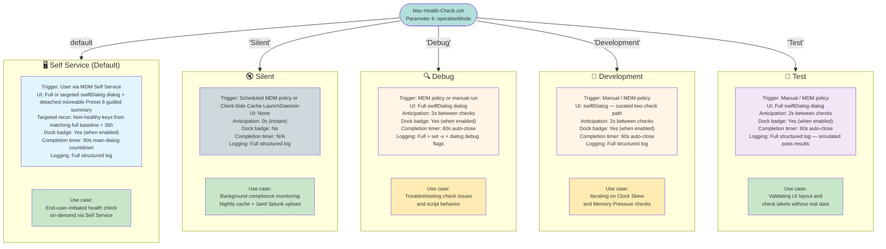

# Mac Health Check: Operation Modes

This diagram compares all five `4.0.0` Mac Health Check operation modes, showing how each mode differs in terms of UI, Dock behavior, logging, and intended use case.


```mermaid
graph TB
    ENTRY(["Mac-Health-Check.zsh<br>Parameter 4: operationMode"])

    subgraph SelfService["🖥️ Self Service (Default)"]
        SS_DESC["Trigger: User via MDM Self Service<br>UI: Full or targeted swiftDialog dialog + detached moveable Preset 6 guided summary<br>Targeted rerun: Non-healthy keys from matching full baseline < 36h<br>Dock badge: Yes (when enabled)<br>Completion timer: 60s main-dialog countdown<br>Logging: Full structured log"]
        SS_USE["Use case:<br>End-user–initiated health check<br>on-demand via Self Service"]

        style SS_DESC fill:#e1f5ff
        style SS_USE fill:#c8e6c9
    end

    subgraph Silent["🔇 Silent"]
        SL_DESC["Trigger: Scheduled MDM policy or Client-Side Cache LaunchDaemon<br>UI: None<br>Anticipation: 0s (instant)<br>Dock badge: No<br>Completion timer: N/A<br>Logging: Full structured log"]
        SL_USE["Use case:<br>Background compliance monitoring<br>Nightly cache + Jamf Splunk upload"]

        style SL_DESC fill:#cfd8dc
        style SL_USE fill:#c8e6c9
    end

    subgraph Debug["🔍 Debug"]
        DB_DESC["Trigger: MDM policy or manual run<br>UI: Full swiftDialog dialog<br>Anticipation: 2s between checks<br>Dock badge: Yes (when enabled)<br>Completion timer: 60s auto-close<br>Logging: Full + set -x + dialog debug flags"]
        DB_USE["Use case:<br>Troubleshooting check issues<br>and script behavior"]

        style DB_DESC fill:#fff4e6
        style DB_USE fill:#ffecb3
    end

    subgraph Development["🔧 Development"]
        DV_DESC["Trigger: Manual / MDM policy<br>UI: swiftDialog — curated two-check path<br>Anticipation: 2s between checks<br>Dock badge: Yes (when enabled)<br>Completion timer: 60s auto-close<br>Logging: Full structured log"]
        DV_USE["Use case:<br>Iterating on Clock Skew<br>and Memory Pressure checks"]

        style DV_DESC fill:#fff4e6
        style DV_USE fill:#ffecb3
    end

    subgraph Test["🧪 Test"]
        TS_DESC["Trigger: Manual / MDM policy<br>UI: Full swiftDialog dialog<br>Anticipation: 2s between checks<br>Dock badge: Yes (when enabled)<br>Completion timer: 60s auto-close<br>Logging: Full structured log — simulated pass results"]
        TS_USE["Use case:<br>Validating UI layout and<br>check labels without real data"]

        style TS_DESC fill:#f3e5f5
        style TS_USE fill:#c8e6c9
    end

    ENTRY -->|default| SelfService
    ENTRY -->|"'Silent'"| Silent
    ENTRY -->|"'Debug'"| Debug
    ENTRY -->|"'Development'"| Development
    ENTRY -->|"'Test'"| Test

    style ENTRY fill:#b2dfdb

    classDef default font-size:11px
```

---

## Mode Comparison Table

| Attribute | Self Service | Silent | Debug | Development | Test |
|---|---|---|---|---|---|
| **Parameter 4 value** | `Self Service` | `Silent` | `Debug` | `Development` | `Test` |
| **Is default?** | Yes | No | No | No | No |
| **swiftDialog UI** | Full dialog | None | Full dialog | Clock Skew and Memory Pressure checks | Full dialog |
| **Anticipation delay** | 2 seconds | 0 seconds | 2 seconds | 2 seconds | 2 seconds |
| **Dock badge** | Yes (when enabled) | No | Yes (when enabled) | Yes (when enabled) | Yes (when enabled) |
| **Completion timer** | 60s on normal full runs | N/A | 60s (configurable) | 60s (configurable) | 60s (configurable) |
| **Inspect config assets** | Yes when `inspectSummaryPreset="on"` | Yes on full health-check runs when `inspectSummaryPreset="on"` | No | No | No |
| **Detached inspect summary** | Yes when `inspectSummaryPreset="on"` (moveable Preset 6) | No | No | No | No |
| **Fresh-config replay** | Yes for healthy reports when `inspectSummaryPreset="on"` and cache age is below `inspectReplayMaximumAgeSeconds` | No | No | No | No |
| **Targeted remediation recheck** | Yes for valid matching non-healthy reports with full baseline under 36 hours | No | No | No | No |
| **Logging** | Full | Full | Full + `set -x` | Full structured log | Full structured log |
| **Real check data** | Yes | Yes | Yes | Yes (Clock Skew and Memory Pressure) | No (simulated pass results) |
| **Local JSON report** | Canonical report | Canonical report | Canonical report | `MacHealthCheck-Report-Development.json` only | `MacHealthCheck-Report-Test.json` only |
| **Splunk HEC / Client-Side Cache install** | Yes | Production only | Yes | No | No |
| **Intended actor** | End user | Automated / Jamf policy | Administrator | Developer | Developer |

---

## Mode Details

### Self Service (Default)
The primary end-user-facing mode. Launched by a user clicking the Mac Health Check policy in MDM Self Service. Before opening the progress dialog, it validates the canonical report against current hardware, MDM vendor, script version, complete check set and 36-hour full-baseline limit. A valid report with non-healthy keys automatically filters the dialog and reruns only those checks. Results merge by stable key into the prior full-state report, untouched checks keep their timestamps, and Inspect is generated from the merged state. Parameter 11 `forceFreshRun=true` or `/var/tmp/MacHealthCheck-Force-Fresh-Run` bypasses targeting and replay. Cached Inspect replay remains available only when the validated report is healthy and the config is younger than `inspectReplayMaximumAgeSeconds`. Missing, stale, malformed or incompatible state falls back to all checks.

**When to use:** Standard deployment for user-initiated compliance checks.

---

### Silent
Runs health checks without displaying any user interface. Intended for scheduled background compliance runs and Client-Side Cache nightly cache refreshes. The `anticipationDuration` is automatically set to `0` in this mode to minimize execution time. Results are written to the client log and persisted to `/Library/Management/org.churchofjesuschrist/MacHealthCheck-Report.json`. Full health-check runs also write `/Library/Management/org.churchofjesuschrist/MacHealthCheck-Inspect-Config.json` and `/Library/Management/org.churchofjesuschrist/MacHealthCheck-Inspect-Compliance.plist` when `inspectSummaryPreset="on"`, without launching swiftDialog. The exact line `Splunk Reporting: local report written to /Library/Management/org.churchofjesuschrist/MacHealthCheck-Report.json` marks a fresh full-run write. The client-side LaunchDaemon run uses `splunkOperationMode=test`, so it never sends to Splunk; Splunk secrets live in the root-only `MacHealthCheck-Secrets.plist` (Jamf Pro policy Parameters 5 and 8 are rejected unless `allowParameterSecrets="true"`). Its plist has no `RunAtLoad`, routes stdout/stderr to `/dev/null`, and scheduled runs set `launchDaemonRun=true`, causing the script to apply deterministic per-Mac jitter across the 00:53-01:53 window centered on 1:23 a.m. If no GUI user is active during that refresh, user-scoped checks fall back to loginwindow `lastUserName`. When Jamf Pro later runs `Silent` with `splunkOperationMode=production`, the script uploads the cached report without running checks if the client-side script version matches and the cache is valid and younger than 36 hours. Reviewers can identify that path by `cached report is valid and <seconds>s old. Skipping health checks.` in the log. Operators can override that shortcut with Parameter 11 `forceFreshRun=true` or `/var/tmp/MacHealthCheck-Force-Fresh-Run`, which removes the cached JSON, forces a complete fresh run, and then delivers newly collected data to Splunk. In practice this often yields an overnight fresh-report write followed by a later-morning Jamf cached upload, so the latest Splunk delivery may contain data collected hours earlier even though the upload itself succeeded recently unless that override is used. Dock integration and other end-user follow-up UI are suppressed.

**When to use:** Continuous background compliance monitoring, nightly local report cache refreshes, and Jamf Pro Splunk uploads without repeating a full health-check run.

---

### Debug
Similar to Self Service, but with `set -x` tracing enabled plus swiftDialog debug launch arguments (`--verbose --resizable --debug red`). Debug mode also enables pretty-printed local JSON reporting, while intentionally retaining the existing countdown-based ending instead of launching the detached inspect summary. This makes it easier to identify which part of the zsh script or dialog rendering is causing unexpected behavior.

**When to use:** Diagnosing why a specific check is failing or returning an unexpected status.

---

### Development
Runs current development subset of checks in normal non-`Silent` dialog flow. The subset includes `checkClockSkew()` and `checkMemoryPressure()`, keeping feedback focused without waiting for a full vendor-specific run. Memory Pressure adds a history sample; use an isolated `memoryPressureHistoryPath` when testing fixtures. The report is written to `/Library/Management/org.churchofjesuschrist/MacHealthCheck-Report-Development.json`; the canonical report, Splunk HEC delivery and the Client-Side Cache install are skipped.

**When to use:** Tuning clock-skew or memory-pressure reporting and dialog presentation while keeping the run shorter than a full production policy.

---

### Test
Builds the full current vendor list item set, then marks each item as a successful simulated result without executing the real health-check functions. The UI renders like production, making this mode useful for validating dialog layout, list item labels, status icon sequencing, and the overall visual presentation. Because its results are synthetic, the report is written only to `/Library/Management/org.churchofjesuschrist/MacHealthCheck-Report-Test.json`; the canonical report, Splunk HEC delivery and the Client-Side Cache install are skipped.

**When to use:** Verifying UI behavior after changing dialog configuration, list item labels, or overall script structure.

---

## Setting the Operation Mode

Operation mode is set via **Parameter 4** in the MDM policy:

```
# MDM Script Parameter 4
Self Service    ← default; omit parameter to use this
Silent
Debug
Development
Test
```

For local testing, pass the mode as the fourth argument:

```bash
sudo zsh Mac-Health-Check.zsh "" "" "" "Debug"
```
