# Mac Health Check: Operation Modes

This diagram compares all five Mac Health Check operation modes, showing how each mode differs in terms of user interface, logging behavior, and intended use case.

```mermaid
graph TB
    ENTRY(["Mac-Health-Check.zsh<br>Parameter 4: operationMode"])

    subgraph SelfService["🖥️ Self Service (Default)"]
        SS_DESC["Trigger: User via MDM Self Service<br>UI: Full swiftDialog dialog<br>Anticipation: 2s between checks<br>Dock badge: Yes (countdown)<br>Completion timer: 60s auto-close<br>Logging: Full structured log"]
        SS_USE["Use case:<br>End-user–initiated health check<br>on-demand via Self Service"]

        style SS_DESC fill:#e1f5ff
        style SS_USE fill:#c8e6c9
    end

    subgraph Silent["🔇 Silent"]
        SL_DESC["Trigger: Scheduled MDM policy<br>UI: None<br>Anticipation: 0s (instant)<br>Dock badge: No<br>Completion timer: N/A<br>Logging: Full structured log"]
        SL_USE["Use case:<br>Background compliance monitoring<br>Pairs with webhook for alerting"]

        style SL_DESC fill:#cfd8dc
        style SL_USE fill:#c8e6c9
    end

    subgraph Debug["🔍 Debug"]
        DB_DESC["Trigger: MDM policy or manual run<br>UI: Full swiftDialog dialog<br>Anticipation: 2s between checks<br>Dock badge: Yes<br>Completion timer: 60s auto-close<br>Logging: Full + set -x shell tracing"]
        DB_USE["Use case:<br>Troubleshooting check failures<br>and script behavior"]

        style DB_DESC fill:#fff4e6
        style DB_USE fill:#ffecb3
    end

    subgraph Development["🔧 Development"]
        DV_DESC["Trigger: Manual / MDM policy<br>UI: swiftDialog — single check only<br>Anticipation: 0s<br>Dock badge: No<br>Completion timer: N/A<br>Logging: Minimal"]
        DV_USE["Use case:<br>Authoring and validating<br>a single new health check"]

        style DV_DESC fill:#fff4e6
        style DV_USE fill:#ffecb3
    end

    subgraph Test["🧪 Test"]
        TS_DESC["Trigger: Manual / MDM policy<br>UI: Full swiftDialog dialog<br>Anticipation: 2s between checks<br>Dock badge: Yes<br>Completion timer: 60s auto-close<br>Logging: Minimal — simulated results"]
        TS_USE["Use case:<br>Validating UI layout and<br>check labels without real data"]

        style TS_DESC fill:#f3e5f5
        style TS_USE fill:#c8e6c9
    end

    ENTRY -->|default| SelfService
    ENTRY -->|"'Silent'"| Silent
    ENTRY -->|"'Debug'"| Debug
    ENTRY -->|"'Development'"| Development
    ENTRY -->|"'Test'"| Test

    style ENTRY fill:#b2dfdb

    classDef default font-size:11px
```



---

## Mode Comparison Table

| Attribute | Self Service | Silent | Debug | Development | Test |
|---|---|---|---|---|---|
| **Parameter 4 value** | `Self Service` | `Silent` | `Debug` | `Development` | `Test` |
| **Is default?** | Yes | No | No | No | No |
| **swiftDialog UI** | Full dialog | None | Full dialog | Single check | Full dialog |
| **Anticipation delay** | 2 seconds | 0 seconds | 2 seconds | 0 seconds | 2 seconds |
| **Dock badge** | Yes | No | Yes | No | Yes |
| **Completion timer** | 60s (configurable) | N/A | 60s (configurable) | N/A | 60s (configurable) |
| **Logging** | Full | Full | Full + `set -x` | Minimal | Minimal |
| **Real check data** | Yes | Yes | Yes | Yes (one check) | No (simulated) |
| **Intended actor** | End user | Automated | Administrator | Developer | Developer |

---

## Mode Details

### Self Service (Default)
The primary end-user–facing mode. Launched by a user clicking the Mac Health Check policy in MDM Self Service. Displays a full swiftDialog dialog with real-time status updates as each check runs. The dialog auto-closes after the `completionTimer` countdown (default: 60 seconds), or the user can dismiss it manually.

**When to use:** Standard deployment for user-initiated compliance checks.

---

### Silent
Runs all health checks without displaying any user interface. Intended for scheduled background compliance runs (e.g., triggered on login or recurring MDM check-in). The `anticipationDuration` is automatically set to `0` in this mode to minimize execution time. Results are written to the client log and (if configured) posted to a webhook.

**When to use:** Continuous background compliance monitoring. Pair with a Teams or Slack webhook to surface failures without interrupting users.

---

### Debug
Identical to Self Service, but with `set -x` shell tracing enabled. All bash commands and variable expansions are printed to stderr, making it easy to identify which line of the script is causing unexpected behavior.

**When to use:** Diagnosing why a specific check is failing or returning an unexpected status.

---

### Development
Runs only a single health check function in isolation, displaying the result in a minimal swiftDialog window. Used when writing or modifying a check function to verify its behavior without running the full suite.

**When to use:** Writing a new health check or tuning an existing check's threshold or remediation message.

---

### Test
Runs the full health check suite but uses simulated (randomized or preset) results instead of real system data. The UI renders exactly as it would in production, making this mode useful for validating dialog layout, check labels, status icons, and the overall visual presentation.

**When to use:** Verifying UI behavior after changing dialog configuration, list item labels, or overall script structure.

---

## Setting the Operation Mode

Operation mode is set via **Parameter 4** in the MDM policy:

```
# MDM Script Parameter 4
Self Service    ← default; omit parameter to use this
Silent
Debug
Development
Test
```

For local testing, pass the mode as the fourth argument:

```bash
sudo zsh Mac-Health-Check.zsh "" "" "" "Debug"
```
