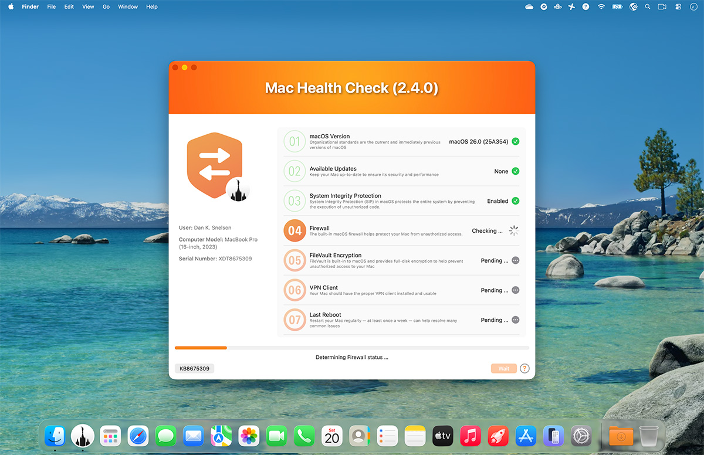
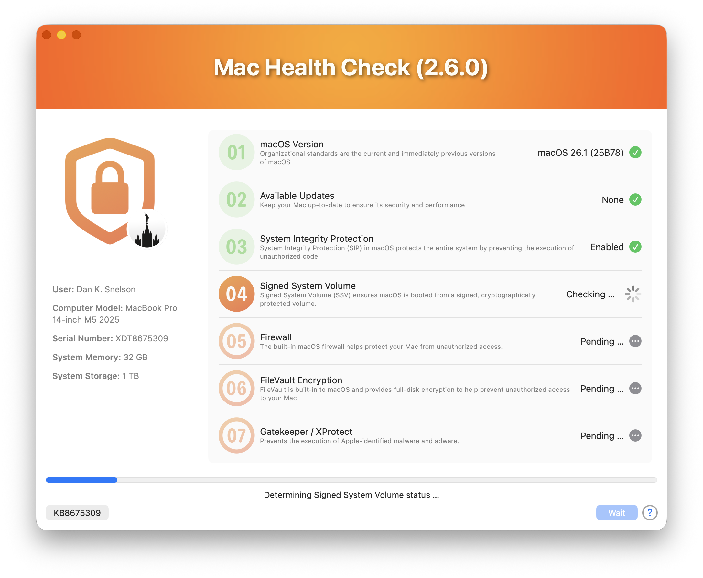
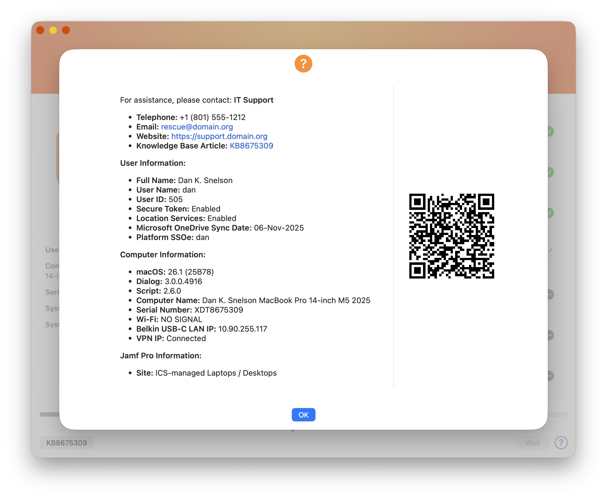

     

# Mac Health Check

> A significant update to the practical and user-friendly approach to surfacing Mac health information directly to end-users via Jamf Pro Self Service



## Overview

Mac Health Check provides a practical and user-friendly approach to surfacing Mac compliance information directly to end-users via Jamf Pro Self Service.

Built using the open-source utility [swiftDialog](https://github.com/swiftDialog/swiftDialog/wiki), the solution acts as a “heads-up display” that presents real-time system health and policy compliance status in a clear and interactive format.

Deployment of Mac Health Check involves configuring organizational defaults, embedding the script in Jamf Pro, creating a policy to run it on demand and testing to ensure proper output and behavior.

Administrators can customize the user interface using swiftDialog’s visual capabilities, making the experience both informative and approachable.

The tool logs results for review, while not altering device configuration, and a new "Silent" Operation Mode makes Mac Health Check ideal for IT visibility without end-user intrusion.

<a href="https://arizona.zoom.us/rec/play/eXXmgFbxmyn1n_y81p0qdFwirdYOXua2AyNqcKoLzt0-u8gHgF0FObggPUBN3iIz1cpMZYcvHThlM4Y.WQEsj2NTeNB-ySdj" target="_blank"><br />Four Corners & Silver State September 2025 Meetup</a> (25-Sep-2025)

## Use Cases

Mac Health Check is particularly valuable in IT support workflows, serving as an initial triage point for Tier 1 support by confirming network access, credentials, and Jamf Pro connectivity, while also acting as a verification tool for Tier 2 teams both during and after remediation efforts.

### Step Zero for Tier 1

- User has a working Internet connection
- User knows their directory credentials
- Mac can execute policies
- Validates Network Access Controls

### Step Ninety-nine for Tier 2

- Initial assessment for support sessions
- Easily confirms remediation efforts
- Provides peace-of-mind for end-users

### Silent Mode

- Silently performs all health checks and logs results
- No dialog is presented to the end-user
- Ideal for background compliance reporting
- Complements existing MDM compliance frameworks

## Features
The following health checks and information reporting are included and the script operates in “test” mode by default. (Change `operationMode` to `production` when ready to deploy in production.)

### Health Checks



1. macOS Version
1. Available Updates (including deferred and DDM-enforced updates)
1. System Integrity Protection
1. Signed System Volume (SSV)
1. Firewall
1. FileVault Encryption
1. Gatekeeper / XProtect
1. Touch ID :new:
1. VPN Client
1. Last Reboot
1. Free Disk Space
1. User's Directory Size and Item Count
    - Desktop
    - Downloads
    - Trash
1. MDM Profile
1. MDM Certificate Expiration
1. Apple Push Notification service
1. Jamf Pro Check-in
1. Jamf Pro Inventory
1. Extended Network Checks
    - Apple Push Notification Hosts
    - Apple Device Management
    - Apple Software and Carrier Updates
    - Apple Certificate Validation
    - Apple Identity and Content Services
    - Jamf Hosts
1. Electron Corner Mask :new: [:link:](https://github.com/electron/electron/pull/48376)
1. Organizationally required Applications (i.e., Microsoft Teams)
1. BeyondTrust Privilege Management*
1. Cisco Umbrella*
1. CrowdStrike Falcon*
1. Palo Alto GlobalProtect*
1. Network Quality Test
1. Update Computer Inventory

*Requires [external check](/external-checks/README.md)

### Information Reporting



#### IT Support
- Telephone
- Email
- Website
- Knowledge Base Article

#### User Information
- Full Name
- User Name
- User ID
- Secure Token
- Location Services
- Microsoft OneDrive Sync Date
- Platform Single Sign-on Extension

#### Computer Information
- macOS version (build)
- System Memory
- System Storage
- Dialog version
- Script version
- Computer Name
- Serial Number
- Wi-Fi SSID
- Wi-FI IP Address
- VPN IP Address

#### Jamf Pro Information**
- Jamf Pro Computer ID
- Site

**[Payload Variables for Configuration Profiles](https://learn.jamf.com/en-US/bundle/jamf-pro-documentation-11.18.0/page/Computer_Configuration_Profiles.html#ariaid-title2)

### Policy Log Reporting

```
MHC (2.6.0): 2025-11-06 03:43:13 - [NOTICE] WARNING: 'localadmin' IS A MEMBER OF 'admin';
User: macOS Server Administrator (localadmin) [503] staff everyone localaccounts _appserverusr 
admin _appserveradm com.apple.sharepoint.group.4 com.apple.sharepoint.group.3
com.apple.sharepoint.group.1 _appstore _lpadmin _lpoperator _developer _analyticsusers
com.apple.access_ftp com.apple.access_screensharing com.apple.access_ssh com.apple.access_remote_ae
com.apple.sharepoint.group.2; Bootstrap Token supported on server: YES;
Bootstrap Token escrowed to server: YES; sudo Check: /etc/sudoers: parsed OK;
sudoers: root  ALL = (ALL) ALL %admin  ALL = (ALL) ALL ; Platform SSOe: localadmin NOT logged in;
Location Services: Enabled; SSH: On; Microsoft OneDrive Sync Date: Not Configured;
Time Machine Backup Date: Not configured; localadmin's Desktop Size: 160M for 116 item(s);
localadmin's Trash Size: 1.8M for 3 item(s); Battery Cycle Count: 0; Wi-Fi: Liahona;
Ethernet IP address: 17.113.201.250; VPN IP: 17.113.201.250; 
Network Time Server: time.apple.com; Jamf Pro Computer ID: 007; Site: Servers
```

1. Warning when logged-in user is a member of `admin`
1. Deferred Software Updates
1. Logged-In User Group Membership
1. Bootstrap Token
1. sudoers
1. Kerberos SSOe
1. Location Services
1. SSH
1. Time Machine
1. Battery Cycle Count
1. Network Time Server
1. Jamf Pro Computer ID

## Support

<a href="https://slack.com/app_redirect?channel=C0977DRT7UY" target="_blank"></a>

Community-supplied, best-effort support is available on the [Mac Admins Slack](https://www.macadmins.org/) (free, registration required) [#mac-health-check Channel](https://slack.com/app_redirect?channel=C0977DRT7UY), or you can open an [issue](https://github.com/dan-snelson/Mac-Health-Check/issues).

## Deployment

<a href="https://snelson.us/mhc" target="_blank"></a><br />
Deployment of Mac Health Check involves configuring organizational defaults, embedding the script in Jamf Pro, creating a policy to run it on demand and testing to ensure proper output and behavior.

<a href="https://snelson.us/mhc" target="_blank">Continue reading …</a>
